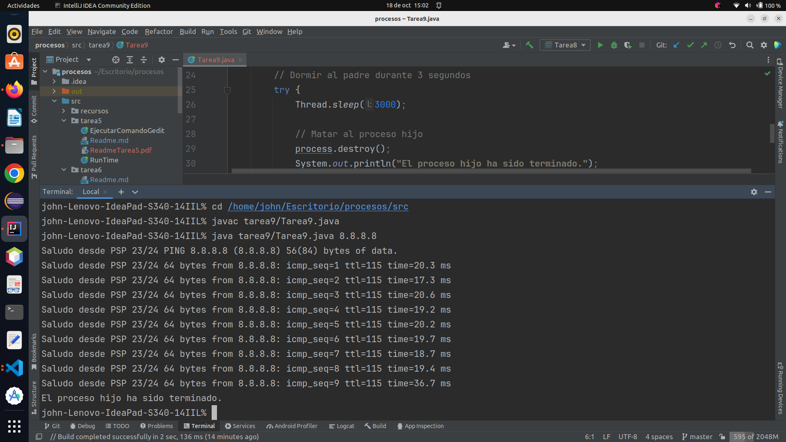
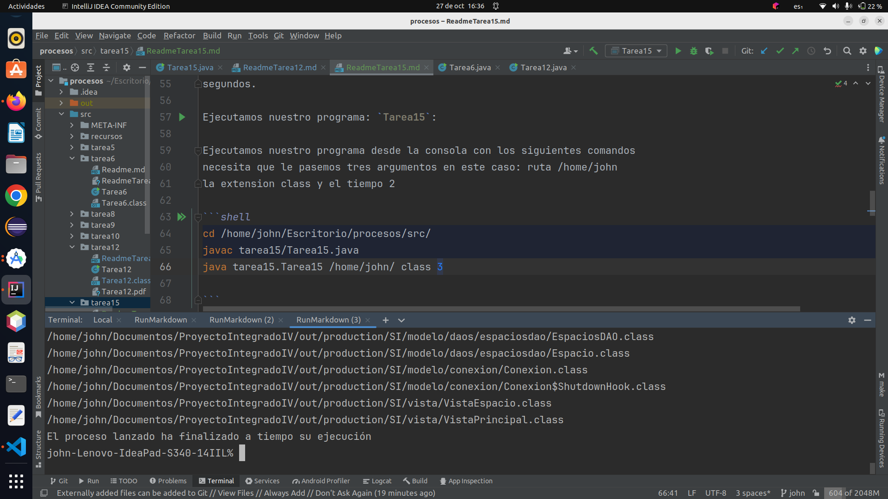
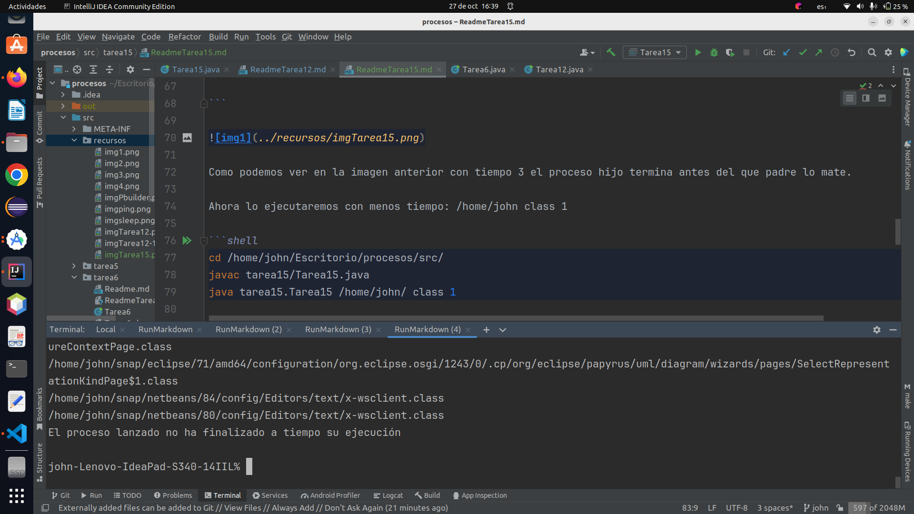
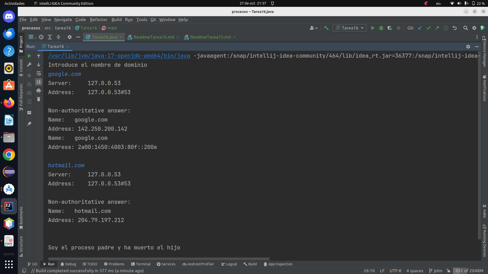

# Actividad 5

1. Buscar información de la clase Runtime de java.
   Probar a ejecutar "mspaint" desde windows o desde linux otro el gedit.

### creamos la clase *EjecutarComandoGenit*

___

```java
import java.io.IOException;

public class EjecutarComandoGedit {
    public static void main(String[] args) {
        abrirGenit();
    }
    public static void abrirGenit() {
        try {
            Process pGedit = Runtime.getRuntime().exec("gedit");
            System.out.println(pGedit);
        } catch (IOException e) {
            e.getLocalizedMessage();
        }
    }
}
```

___

Ejecutamos nuestro programa: `EjecutarComandoGedit`

___


___

2. Desde Ubuntu, Crear un programa con Runtime, que permita mostrar por pantalla toda la información
   del directorio "/etc/init.d" pasado como argumento a nuestro programa java. El padre debe mostrar en
   pantalla la ejecución del hijo con el getInputStream().

### Creamos la clase *RunTime*

___

```java
import java.io.BufferedReader;
import java.io.IOException;
import java.io.InputStream;
import java.io.InputStreamReader;

public class RunTime {
    public static void main(String[] args) {
        ejecutarComando();
    }
    public static void ejecutarComando() {
        try {
            Process p = Runtime.getRuntime().exec("ls /etc/init.d");
            InputStream inputStream = p.getInputStream();
            BufferedReader br = new BufferedReader(new InputStreamReader(inputStream));
            String linea = br.readLine();
            while (linea != null){
                System.out.println(linea);
                linea = br.readLine();
            }
        } catch (IOException e) {
            e.getLocalizedMessage();
        }
    }
}
```

___

Ejecutamos nuestro programa: `RunTime`

___


___

# Actividad 6

1. Queremos realizar un programa que haga el comando ls -l > "un_fichero.txt"
   Para ello, crear un fichero con File al que pasarás su nombre como argumento a nuestro main.
   Utilizar dos buffers, uno para la redirección del flujo de entrada al padre (lo que le devuelve el proceso hijo al padre) y otro para la escritura en un fichero desde el padre a partir del FileWriter.
   Para probar nuestro ejemplo, debemos poner algo así ./tarea6 fichero2.txt

### Creamos la clase *Tarea6*

___

```java
import java.io.*;

public class Tarea6 {
   public static void main(String[] args) {
      if (args.length != 1) {
         System.out.println("Uso: ./tarea6 fichero.txt");
         System.exit(1);
      }

      String filename = args[0];

      try {
         ProcessBuilder processBuilder = new ProcessBuilder("ls", "-l");
         Process process = processBuilder.start();
         InputStream inputStream = process.getInputStream();
         BufferedReader reader = new BufferedReader(new InputStreamReader(inputStream));

         FileWriter fileWriter = new FileWriter(filename);
         String line;
         while ((line = reader.readLine()) != null) {
            fileWriter.write(line + "\n");
         }
         fileWriter.close();
      } catch (IOException  e) {
         e.getLocalizedMessage();
      }
   }
}
```

___

Ejecutamos nuestro programa: `Tarea6`

Ejecutamos nuestro programa desde la consola con los siguientes comandos
necesita que le pasemos un argumento en este caso: *fichero.txt*

___

```shell
cd /home/john/Escritorio/procesos/src/      
javac tarea6/Tarea6.java              
java tarea6.Tarea6 fichero.txt

```
___


___

Se ha creado nuestro fichero *'fichero.txt'*, lo abrimos y vemos que
tiene la información que le hemos pedido al proceso hijo.

___


___

# Actividad 8

1. A partir del ejemplo visto en clase con el ping 8.8.8.8, probarlo y hacer:

   * Probarlo en windows donde el padre espere a que el hijo muera (4 ping)
   * Probarlo en linux, donde el padre muestre 10 ping del hijo y luego lo mate)
   * ¿Qué sucede si en la ejecución del hijo, el padre no lo mata?


## Probaremos el programa en linux.

### Creamos la clase *Tarea8*

___

```java
import java.io.BufferedReader;
import java.io.IOException;
import java.io.InputStreamReader;

public class Tarea8 {
    public static void main(String[] args) {
        Runtime runtime = Runtime.getRuntime();
        Process process = null;

        try {
            process = runtime.exec("ping " + args[0]);
            BufferedReader in = new BufferedReader(new InputStreamReader(process.getInputStream()));
            for (int i = 0; i < 10; i++) {
                System.out.println("Saludo desde PSP 23/24 " + in.readLine());
            }
        } catch (IOException e) {
            System.out.println("No pudimos correr el ping desde nuestra clase");
            System.exit(-1);
        }
        if (process!= null) {
            process.destroy();
            System.out.println("Me he cargado el ping.....");
        }
        try {
            System.out.println("Ahora esperare a que acabe mi proceso ping");
            process.waitFor();
            System.out.println("Ya no existe mi proceso ping");
        }catch (InterruptedException e) {
            System.out.println("No pudimos esperar por que termino");
            System.exit(-1);
        }
        System.out.println("Estado de termino: " + process.exitValue());
        System.exit(0);

    }
}
```
___

### Uso

El programa se ejecuta desde la línea de comandos y requiere un argumento que debe ser la dirección IP o el nombre de
host al que se le realizará el ping.

### Ejecutamos nuestro programa: `Tarea8`

Ejecutamos nuestro programa desde la consola con los siguientes comandos
en mi caso son estos porque mi proyecto se encuentra en el escritorio y mi programa
se encuentra en el package tarea8, le pasemos un argumento en este caso: 8.8.8.8

___

```shell
cd /home/john/Escritorio/procesos/src      
javac tarea8/Tarea8.java 
java tarea8/Tarea8.java 8.8.8.8

```

___


___

Este programa ejecuta el comando "ping" en un sistema operativo, en este caso linux, tomando como argumento la
dirección IP o el nombre de host proporcionado en la línea de comandos.


### Descripción

El programa utiliza la clase `Runtime` para interactuar con el sistema operativo y ejecutar el comando "ping" en una
nueva instancia de proceso. Luego, captura y muestra la salida del comando "ping" en la consola. Después de 10 líneas
de salida del "ping", se destruye el proceso "ping".

### Detalles del Programa

1. Se crea una instancia de la clase Runtime y un objeto Process para gestionar el proceso de ping.

2. El programa intenta ejecutar el comando "ping" con la dirección IP o nombre de hosts proporcionados en la línea de
   comandos. En caso de error, se muestra un mensaje y se sale del programa.

3. Se crea un objeto BufferedReader para leer la salida del proceso "ping".

4. El programa entra en un bucle que recorre 10 líneas de la salida del "ping". En cada iteración del bucle, muestra la
   línea de salida en la consola con un mensaje de saludo.

5. Después de recopilar 10 líneas de salida del "ping", el proceso "ping" se destruye.

6. El programa espera a que el proceso "ping" finalice.

7. Una vez que el proceso ha finalizado, se muestra el estado de terminación del proceso.

8. El programa sale con un código de salida apropiado.

### Observaciones

* El programa utiliza el comando "ping" para realizar un ping a la dirección IP o nombre de hosts proporcionados, y
  muestra las respuestas en la consola.
* Si el proceso "ping" no puede iniciarse, se mostrará un mensaje de error y el programa se cerrará con un código de error.
* Después de capturar 10 líneas de salida del "ping", el proceso "ping" se destruirá para finalizarlo.
* Finalmente, el programa espera a que el proceso "ping" finalice y muestra el estado de terminación del proceso.

####  ¿Qué sucede si en la ejecución del hijo, el padre no lo mata?

Si el padre no mata al proceso hijo y lo deja en ejecución, el programa se quedará en un estado de espera indefinido,
ya que la llamada `process.waitFor()` bloqueará la ejecución del padre hasta que el proceso hijo termine.

En otras palabras, si el proceso hijo no se cierra o finaliza por sí solo, el programa padre se mantendrá en espera
y no continuará ejecutando ninguna operación adicional. En este escenario, el programa quedará "atascado"
indefinidamente hasta que el proceso hijo se cierre de alguna manera, ya sea por la finalización natural de la operación
de ping o por intervención manual del usuario para finalizar el proceso.

Por lo tanto, es importante asegurarse de que el proceso hijo pueda finalizar correctamente o, en caso de ser necesario,
implementar una lógica adicional para finalizar el proceso hijo desde el padre en función de ciertas condiciones o
límites de tiempo, para evitar que el programa quede bloqueado en un estado de espera indefinido.


# Actividad 9

1. A partir del ejercicio anterior y en linux, dormir al padre por 3 segundos y transcurridos matar al hijo.


### Creamos la clase *Tarea9*

___

```java
import java.io.BufferedReader;
import java.io.IOException;
import java.io.InputStreamReader;

public class Tarea9 {
   public static void main(String[] args) {
      Runtime runtime = Runtime.getRuntime();
      Process process = null;

      try {
         process = runtime.exec("ping " + args[0]);
         BufferedReader in = new BufferedReader(new InputStreamReader(process.getInputStream()));
         for (int i = 0; i < 10; i++) {
            System.out.println("Saludo desde PSP 23/24 " + in.readLine());
         }

      } catch (IOException e) {
         System.out.println("No pudimos correr el ping desde nuestra clase");
         System.exit(-1);
      }

      // Dormir al padre durante 3 segundos
      try {
         Thread.sleep(3000);

         // Matar al proceso hijo
         process.destroy();
         System.out.println("El proceso hijo ha sido terminado.");
      } catch (InterruptedException e) {
         throw new RuntimeException(e);
      }
   }
}
```
___

### Uso

El programa se ejecuta desde la línea de comandos y requiere un argumento que debe ser la dirección IP o el nombre de
host al que se le realizará el ping.

Ejecutamos nuestro programa: `Tarea9`

Ejecutamos nuestro programa desde la consola con los siguientes comandos
en mi caso son estos porque mi proyecto se encuentra en el escritorio y mi programa
se encuentra en el package tarea9, le pasemos un argumento en este caso: 8.8.8.8

___

```shell
cd /home/john/Escritorio/procesos/src      
javac tarea9/Tarea9.java 
java tarea9/Tarea9.java 8.8.8.8

```

___




___

Este programa ejecuta el comando "ping" en un sistema operativo, tomando como argumento la
dirección IP o el nombre de host proporcionado en la línea de comandos.


### Descripción

El programa utiliza la clase `Runtime` para interactuar con el sistema operativo y ejecutar el comando "ping" en una
nueva instancia de proceso. Luego, captura y muestra la salida del comando "ping" en la consola. Después de 10 líneas
de salida del "ping", podremos a dormir al proceso padre y luego destruye el proceso "ping".

### Detalles del Programa

1. Se crea una instancia de la clase Runtime y un objeto Process para gestionar el proceso de ping.

2. El programa intenta ejecutar el comando "ping" con la dirección IP o nombre de hosts proporcionados en la línea de
   comandos. En caso de error, se muestra un mensaje y se sale del programa.

3. Se crea un objeto BufferedReader para leer la salida del proceso "ping".

4. El programa entra en un bucle que recorre 10 líneas de la salida del "ping". En cada iteración del bucle, muestra la
   línea de salida en la consola con un mensaje de saludo y las respuestas del ping.

5. Después de recopilar 10 líneas de salida del "ping", ponemos a dormir al proceso padre por 3 segundo.

6. Pasados los tres segundos, el proceso padre mata al proceso hijo.

7. Se muestra el mensaje que el proceso hijo ha finalizado.

### Observaciones

* El programa utiliza el comando "ping" para realizar un ping a la dirección IP o nombre de hosts proporcionados, y
  muestra las respuestas en la consola.
* Si el proceso "ping" no puede iniciarse, se mostrará un mensaje de error y el programa se cerrará con un código de error.
* Después de capturar 10 líneas de salida del "ping", dormiremos al proceso padre tres segundos, transcurridos los tres
  segundos el proceso padre destruirá al proceso hijo.
* Finalmente, el programa muestra el estado de terminación del proceso.


# Actividad 10

1. Crear un clon del ls -l del realizado con el Runtime, pero ahora con el ProcessBuilder.
2. ¿Qué sucede si el comando se lo pasamos de la forma "ls -l"?

## Crear un clon del ls -l del realizado con el Runtime, pero ahora con el ProcessBuilder.

### creamos la clase *RunTimeProcessBuilder*

___

```java
import java.io.BufferedReader;
import java.io.IOException;
import java.io.InputStreamReader;

public class RunTimeProcessBuilder {
    public static void main(String[] args) {

        try {
            // Crear un objeto ProcessBuilder para ejecutar el comando "ls -l"
            ProcessBuilder processBuilder = new ProcessBuilder("ls","-l");
            // Iniciar el proceso
            Process process = processBuilder.start();

            // Capturar la salida del comando "ls -l"
            BufferedReader reader = new BufferedReader(new InputStreamReader(process.getInputStream()));
            String line;
            // Leer y mostrar la salida línea por línea
            while ((line = reader.readLine()) != null) {
                System.out.println(line);
            }

            // Esperar a que el proceso hijo termine
            process.waitFor();
            System.out.println("El comando 'ls -l' ha finalizado.");
        } catch (IOException | InterruptedException e) {
            e.printStackTrace();
        }
    }
}
```
___

Ejecutamos nuestro programa: `RunTimeProcessBuilder`

___


___

Este programa utiliza ProcessBuilder para ejecutar el comando ls -l, captura su salida y muestra los resultados en la
consola.

## ¿Qué sucede si el comando se lo pasamos de la forma "ls -l"?

El constructor de ProcessBuilder espera que los argumentos se pasen como elementos separados en la lista, no como
una única cadena con espacios. Al usar "ls -l" como una sola cadena, el comando no se interpreta correctamente.

El enfoque correcto es pasar "ls" y "-l" como argumentos separados:

```
ProcessBuilder processBuilder = new ProcessBuilder("ls", "-l");
```


# Actividad 12

1. A partir del ejemplo visto en clase con el comando find y el ProcessBuilder, probarlo con un tiempo de espera pasado como argumento desde el main la ruta a buscar, la extensión de los ficheros y el tiempo de espera máximo en segundos a esperar desde el padre. Transcurridos los 2000 milisegundos, el padre deberá matar al hijo. Para probar diferentes opciones, probar a que la búsqueda sea mayor a los 2 segundos.

   * la ejecución deberá ser algo como /java ejemplo_find /home/<usuario> class 2
   * El comando a ejecutar sería tal como find /home/santi  -name "*.class" 2000

### Creamos la clase *Tarea12*

___

```java
import java.io.IOException;
import java.util.concurrent.TimeUnit;

public class Tarea12 {
    public static void main(String[] args) {
        if (args.length != 3) {
            System.out.println("Uso:  <ruta> <extensión> <tiempo en segundos>");
            System.exit(1);
        }

        String ruta = args[0];
        String extension = args[1];
        int tiempoEspera = Integer.parseInt(args[2]) * 1000; // Convierte segundos a milisegundos

        ProcessBuilder processBuilder = new ProcessBuilder("find", ruta, "-name", "*." + extension);
        System.out.println("Como proceso actual, voy a ejecutar un comando find por un tiempo" +
                "mediante otro proceso\n");
        processBuilder.inheritIO(); //El proceso actual y el nuevo, utilizan las mismas E/S
        processBuilder.redirectErrorStream(true);// para que no salgan las salidas y errores mezclados
        try {
            Process p = processBuilder.start();//Lanzamos el nuevo proceso
            if (!p.waitFor(tiempoEspera, TimeUnit.MILLISECONDS)) {
                p.destroy();//matamos al proceso hijo.
                /*
                    whaitfor() devuelve true si el nuevo proceso
                    ha terminado el mismo antes del tiempo indicado
                */
                System.out.println("\nEl proceso lanzado no ha finalizado a tiempo su ejecucion\n");
            }
            System.out.println("El proceso lanzado ha finalizado a tiempo su ejecucion");
        } catch (IOException  e) {
            System.out.println("Error al intentar lanzar un nuevo proceso. pedimos informacion detallada\n");
            e.printStackTrace();
            System.exit(1);//error en el proceso
        }catch(InterruptedException e){
            System.out.println("El proceso ha sido interrumpido mediante interrumpción\n");
            System.exit(2);
        }
    }
}
```
___

### Uso

El programa se ejecuta desde la línea de comandos y requiere tres argumentos que debe ser la ruta la extension y los
segundos.

Ejecutamos nuestro programa: `Tarea12`

Ejecutamos nuestro programa desde la consola con los siguientes comandos
necesita que le pasemos tres argumentos en este caso: ruta /home/john
la extension class y el tiempo 2

___

```shell
cd /home/john/Escritorio/procesos/src/      
javac tarea12/Tarea12.java              
java tarea12/Tarea12.java /home/john class 2   

```

___


___

Como podemos ver en la imagen anterior con tiempo 2 el proceso hijo termina antes del que padre lo mate.

Ahora lo ejecutaremos con menos tiempo: /home/john class 1

___

```shell
cd /home/john/Escritorio/procesos/src/      
javac tarea12/Tarea12.java              
java tarea12/Tarea12.java /home/john class 1   

```
___


___

Como podemos ver en la imagen anterior con tiempo 1 el proceso hijo no termina antes del que padre lo mate.

### Detalles del programa:

1. El programa espera tres argumentos desde la línea de comandos: <ruta>, <extensión>, y <tiempo en segundos>. Estos
   argumentos se utilizan para configurar la búsqueda y el tiempo de espera.

2. Se convierte el tiempo de espera de segundos a milisegundos, ya que el método p.waitFor espera en milisegundos.

3. Se crea un objeto ProcessBuilder para ejecutar el comando find con los argumentos proporcionados.

4. processBuilder.inheritIO() se utiliza para que el proceso actual y el nuevo proceso compartan las mismas entradas y
   salidas estándar. Esto significa que las salidas del proceso hijo se mostrarán en la consola del proceso actual.

5. processBuilder.redirectErrorStream(true) se utiliza para redirigir las salidas de error al flujo de salida estándar,
   evitando que las salidas y los errores se mezclen.

6. Se inicia el nuevo proceso con processBuilder.start().

7. El programa espera el tiempo especificado utilizando p.waitFor(tiempoEspera, TimeUnit.MILLISECONDS). Si el proceso
   hijo no ha finalizado dentro del tiempo especificado, se mata utilizando p.destroy().

8. El programa maneja las excepciones IOException y InterruptedException que puedan surgir durante la ejecución del
   proceso hijo. Si se produce un error, se muestra un mensaje de error y se sale del programa con un código de error
   apropiado.

En resumen, este programa ejecuta el comando find en un proceso hijo y verifica si el proceso hijo finaliza dentro del
tiempo especificado. Si el proceso no finaliza a tiempo, se mata y se muestra un mensaje de error.

---

# Actividad 15

1. A partir del ejemplo del find, adaptarlo con las clases Scanner y PrintWriter

### Creamos la clase *Tarea15*

___

```java
public class Tarea15 {
    public static void main(String[] args) {
        if (args.length != 3) {
            System.out.println("Uso: <ruta> <extensión> <tiempo en segundos>");
            System.exit(1);
        }

        String ruta = args[0];
        String extension = args[1];
        int tiempoEspera = Integer.parseInt(args[2]) * 1000; // Convierte segundos a milisegundos

        try {
            ProcessBuilder processBuilder = new ProcessBuilder("find", ruta, "-name", "*." + extension);
            processBuilder.inheritIO(); //El proceso actual y el nuevo, utilizan las mismas E/S
            processBuilder.redirectErrorStream(true); // Redirige la salida de error al proceso actual

            Process p = processBuilder.start(); // Lanza el nuevo proceso
            Scanner scanner = new Scanner(new InputStreamReader(p.getInputStream()));

            System.out.println("Como proceso actual, voy a ejecutar un comando find por un tiempo" +
                    "mediante otro proceso\n");

            if (!p.waitFor(tiempoEspera, TimeUnit.MILLISECONDS)) {
                p.destroy(); // Mata el proceso hijo
                System.out.println("El proceso lanzado no ha finalizado a tiempo su ejecución\n");
            } else {
                System.out.println("El proceso lanzado ha finalizado a tiempo su ejecución");
            }

            // Leer la salida del proceso y mostrarla en la consola
            while (scanner.hasNextLine()) {
                System.out.println(scanner.nextLine());
            }
        } catch (IOException e) {
            System.out.println("Error al intentar lanzar un nuevo proceso. Pedimos información detallada\n");
            e.printStackTrace();
            System.exit(1); // Error en el proceso
        } catch (InterruptedException e) {
            System.out.println("El proceso ha sido interrumpido mediante interrupción\n");
            System.exit(2);
        }
    }
}
```
___

### Uso

El programa se ejecuta desde la línea de comandos y requiere tres argumentos que debe ser la ruta, la extension y los
segundos.

Ejecutamos nuestro programa: `Tarea15`:

Ejecutamos nuestro programa desde la consola con los siguientes comandos
necesita que le pasemos tres argumentos en este caso: ruta /home/john
la extension class y el tiempo 2

___

```shell
cd /home/john/Escritorio/procesos/src/ 
javac tarea15/Tarea15.java              
java tarea15.Tarea15 /home/john/ class 3  

```
___




___

Como podemos ver en la imagen anterior con tiempo 3 el proceso hijo termina antes del que padre lo mate.

Ahora lo ejecutaremos con menos tiempo: /home/john class 1

---

```shell
cd /home/john/Escritorio/procesos/src/ 
javac tarea15/Tarea15.java              
java tarea15.Tarea15 /home/john/ class 1  

```

___



___

Como podemos ver en la imagen anterior con tiempo 1 el proceso hijo no termina antes del que padre lo mate.

### Detalles del programa:

1. El programa espera tres argumentos desde la línea de comandos: <ruta>, <extensión>, y <tiempo en segundos>. Estos
   argumentos se utilizan para configurar la búsqueda y el tiempo de espera.

2. Se convierte el tiempo de espera de segundos a milisegundos, ya que el método p.waitFor espera en milisegundos.

3. Se crea un objeto ProcessBuilder para ejecutar el comando find con los argumentos proporcionados.

4. processBuilder.inheritIO() se utiliza para que el proceso actual y el nuevo proceso compartan las mismas entradas y
   salidas estándar. Esto significa que las salidas del proceso hijo se mostrarán en la consola del proceso actual.

5. processBuilder.redirectErrorStream(true) se utiliza para redirigir las salidas de error al flujo de salida estándar,
   evitando que las salidas y los errores se mezclen.

6. Se inicia el nuevo proceso con processBuilder.start().

7. El programa espera el tiempo especificado utilizando p.waitFor(tiempoEspera, TimeUnit.MILLISECONDS). Si el proceso
   hijo no ha finalizado dentro del tiempo especificado, se mata utilizando p.destroy().

8. El programa maneja las excepciones IOException y InterruptedException que puedan surgir durante la ejecución del
   proceso hijo. Si se produce un error, se muestra un mensaje de error y se sale del programa con un código de error
   apropiado.

En resumen, este programa ejecuta el comando find en un proceso hijo y verifica si el proceso hijo finaliza dentro del
tiempo especificado. Si el proceso no finaliza a tiempo, se mata y se muestra un mensaje de error.

___

# Actividad 16

1. Modificar el ejemplo del nslookup visto en clase (el de la presentación), utilizando las clases Scanner y
   PrintWriter. Utilizar la redirección de salida, para que ambos procesos escriban en pantalla.
* Que el hijo herede la salida del padre, para ver en todo momento lo que sucede.
* Utilizar la clase Scanner, para leer desde teclado los dominios que el padre debe pasar al hijo.
* Utilizar el PrintWriter, para conectar la salida del padre con la entrada del hijo. (Para pasarle los dominios)

El programa **Tarea16** se utiliza para realizar búsquedas de información de servidores DNS utilizando el comando
`nslookup`. El programa permite al usuario introducir un nombre de dominio y realiza consultas DNS utilizando
dicho nombre. A continuación, se proporciona una descripción detallada del programa:

Creamos la clase `Tarea16`:


```java
public class Tarea16 {
    public static void main(String[] args) {
        ProcessBuilder pb = new ProcessBuilder("nslookup");
        pb.redirectOutput(ProcessBuilder.Redirect.INHERIT);
        System.out.println("Introduce el nombre de dominio");
        Scanner sc = new Scanner(System.in);
        String linea;
        Process p = null;
        try {
            while(((linea = sc.nextLine()) != null) && linea.length() != 0) {
                p = pb.start();
                PrintWriter out = new PrintWriter(p.getOutputStream());
                out.println(linea);
                out.close();
            }
        try {
            p.waitFor();
            System.out.println("Soy el proceso padre y ha muerto el hijo");
        } catch (InterruptedException e) {
            System.out.println("Se ha interrumpido el proceso");
        }
        } catch (Exception e) {
            System.out.println("Algo ha petado");
        }
    }
}

```
___

Imagen de ejecucion del programa:

___



___

## Descripción del Programa

- `ProcessBuilder pb = new ProcessBuilder("nslookup");`: Se crea un objeto `ProcessBuilder` que se utiliza para
  ejecutar el comando `nslookup`. `ProcessBuilder` permite iniciar un nuevo proceso y gestionar sus entradas/salidas.

- `pb.redirectOutput(ProcessBuilder.Redirect.INHERIT);`: Esta línea redirige la salida del proceso hijo a la salida
  estándar del proceso actual. Esto significa que cualquier salida generada por el proceso `nslookup` se mostrará
  directamente en la consola.

- `Scanner sc = new Scanner(System.in);`: Se crea un objeto `Scanner` para leer la entrada del usuario desde la consola.

- `String linea;`: Se declara una variable `linea` que se utilizará para almacenar la entrada del usuario.

- `Process p = null;`: Se declara una variable `p` para representar el proceso hijo, inicialmente establecida como nula.

- El programa entra en un bucle `while` que continuará ejecutándose mientras el usuario introduzca líneas de entrada.
  El bucle se ejecuta de la siguiente manera:
   - `linea = sc.nextLine()`: Lee una línea de entrada del usuario y la almacena en la variable `linea`.
   - `p = pb.start();`: Se inicia un nuevo proceso utilizando el comando `nslookup`. Este proceso se ejecuta en
     paralelo con el programa actual.

   - `PrintWriter out = new PrintWriter(p.getOutputStream());`: Se crea un objeto `PrintWriter` para escribir datos
     en la entrada del proceso hijo. Esto permite enviar el nombre de dominio introducido por el usuario al
     proceso `nslookup`.

   - `out.println(linea);`: Se escribe la línea introducida por el usuario en la entrada del proceso `nslookup`.

   - `out.close();`: Se cierra el `PrintWriter` después de escribir la línea.

- Después de que el usuario deje de introducir líneas, el programa sale del bucle `while`.

- A continuación, el programa espera a que el proceso hijo (`nslookup`) termine utilizando `p.waitFor()`.
  Durante este tiempo, el programa se bloquea hasta que el proceso hijo finalice.

- Finalmente, se muestra un mensaje que indica que el proceso padre ha detectado que el proceso hijo ha terminado
  o se ha interrumpido en caso de error.

- El programa maneja las excepciones en caso de errores y muestra mensajes adecuados en función del tipo de error.

El programa básicamente permite a un usuario ejecutar consultas `nslookup` ingresando nombres de dominio y ver la
salida de esas consultas en la consola.

Es importante mencionar que la interacción con la línea de comandos en tiempo real se realiza mediante el proceso hijo
y la comunicación a través de `ProcessBuilder`, que permite ejecutar comandos en un sistema operativo desde una aplicación Java.

___

# Tarea 17

Modificar el ejemplo del nslookup anterior, sin que se herede la salida del padre al hijo. Obtener desde el hijo,
su inputStream hacia el padre para que muestre los resultados por pantalla. Recordar cerrar el flujo de salida del
subproceso.

Creamos la clase `Tarea17`:

___

```java
public class Tarea17 {
    public static void main(String[] args) throws IOException {
        // Configuracion ProcessBuilder utilizando el comando "nslookup"
        ProcessBuilder pb = new ProcessBuilder("nslookup");
        try {
            InputStreamReader isrin = new InputStreamReader(System.in, "UTF-8");
            BufferedReader brin = new BufferedReader(isrin);
            String linea;
            System.out.println("Introduce el nombre del dominio");
            Process p = null;
            while ((linea = brin.readLine()) != null && linea.length() != 0) {
                // Iniciar el proceso "nslookup"
                p = pb.start();
                try {
                    // Configurar la salida del proceso para enviar la entrada del usuario
                    OutputStream osp = p.getOutputStream();
                    OutputStreamWriter oswp = new OutputStreamWriter(osp, "UTF-8");
                    oswp.write(linea);
                    oswp.close();

                    // Leer la salida del proceso "nslookup"
                    InputStream isp = p.getInputStream();
                    InputStreamReader isrp = new InputStreamReader(isp, "UTF-8");
                    BufferedReader br = new BufferedReader(isrp);
                    String linea2;
                    while ((linea2 = br.readLine()) != null) {
                        // Mostrar la salida del proceso "nslookup"
                        System.out.println(linea2);
                    }
                } catch (UnsupportedEncodingException e) {
                    System.out.println(e.getMessage());
                }
            }
            try {
                // Esperar a que el proceso hijo termine
                p.waitFor();
                System.out.println("Proceso hijo termino correctamente");
            } catch (InterruptedException e) {
                System.out.println(e.getMessage());;
            }

        }catch (IOException e){
            System.out.println("Error: E/S");
            System.out.println(e.getMessage());
        }
    }
}

```
___

Ejecutamos el programa:

___


___

Se crea un ProcessBuilder llamado pb para ejecutar el comando "nslookup". Este proceso se utilizará para realizar
búsquedas de DNS.

Se configura un lector de entrada estándar (System.in) para recibir la entrada del usuario. Se crea un lector de entrada
(InputStreamReader) y un BufferedReader para leer la entrada del usuario.

El programa entra en un bucle while que permite al usuario ingresar nombres de dominio para buscar en el servidor DNS.
Cada nombre de dominio se almacena en la variable linea.

Dentro del bucle, se inicia el proceso "nslookup" utilizando pb.start(). Esto permite ejecutar comandos en un proceso
separado.

Se configura la salida del proceso para que coincida con la entrada proporcionada por el usuario. El nombre de dominio
ingresado se escribe en la salida del proceso.

Se configura un lector de entrada para capturar la salida del proceso "nslookup". Esto se hace para que el programa
pueda leer y mostrar la información de DNS que se recibe.

Se lee la salida línea por línea y se muestra en la consola del usuario.

El programa controla excepciones, como problemas de codificación o interrupciones del proceso.

Después de que el usuario haya terminado de ingresar nombres de dominio, se espera a que el proceso hijo "nslookup"
termine utilizando p.waitFor().

El programa muestra un mensaje indicando que el proceso hijo ha terminado correctamente.

Si se produce algún error de E/S durante la ejecución, el programa captura la excepción y muestra un mensaje de error.

___

# TAREA CLASE

### Crear un programa completo, compuesto por dos ficheros java, uno que sea el principal y otro que sea un jar.
* La idea es sencilla. Desde el programa principal, se leerá un texto por teclado y se creará un subproceso
  mediante la llamada a otro fichero jar, llamado convertir-mayusculas.jar. Dicho jar deberá leer de su flujo
  de entrada dicho texto y devolverle al principal ese mismo texto convertido a mayúsculas.

Creamos la clase **Principal**:

___

```java
public class Principal {
    public static void main(String[] args) {

        ProcessBuilder pb = new ProcessBuilder("java","-jar","src/tareaClase/ConvertirMayuscula.jar");
        Scanner sc = new Scanner(System.in);
        System.out.println("Ingresa cadena a convertir");
        String linea = sc.nextLine();

        try {
            Process p = pb.start();
            OutputStream osp = p.getOutputStream();
            OutputStreamWriter osw = new OutputStreamWriter(osp);
            osw.write(linea);
            osw.close();

            InputStream isp = p.getInputStream();
            InputStreamReader isr = new InputStreamReader(isp);
            BufferedReader br = new BufferedReader(isr);
            String linea2 = br.readLine();
            System.out.println(linea2);
            br.close();

            p.waitFor();
        }catch (IOException | InterruptedException e){
            e.getStackTrace();
        }
    }
}
```
___

Creamos la clase **CovertirMayuscula**:

___

```java
public class ConvertirMayuscula {
    public static void main(String[] args) {
        Scanner sc = new Scanner(System.in);
        String linea = sc.nextLine();
        System.out.println(linea.toUpperCase());
    }
}
```
___

Imagen de la ejecucion del programa **Principal**:

___


___

# Explicación de los Programas Principal y ConvertirMayuscula

## Programa Principal

El programa **Principal** utiliza la clase `ProcessBuilder` para iniciar un nuevo proceso Java que ejecuta el programa
**ConvertirMayuscula**. El objetivo del programa es tomar una entrada de cadena del usuario, pasarla al proceso
**ConvertirMayuscula** y mostrar la salida en mayúsculas. Aquí está el flujo principal del programa:

1. `ProcessBuilder pb = new ProcessBuilder("java","-jar","src/tareaClase/ConvertirMayuscula.jar");`: Se crea un objeto
   `ProcessBuilder` que se utiliza para iniciar un nuevo proceso Java. El proceso se inicia utilizando el archivo JAR
   "ConvertirMayuscula.jar".

2. `Scanner sc = new Scanner(System.in);`: Se crea un objeto `Scanner` para leer la entrada del usuario desde la
   consola.

3. `System.out.println("Ingresa cadena a convertir");`: Se muestra un mensaje en la consola solicitando al usuario
   que introduzca una cadena.

4. `String linea = sc.nextLine();`: Se lee la línea de entrada del usuario y se almacena en la variable `linea`.

5. `try {...}`: Se inicia un bloque `try` para manejar las excepciones.

6. `Process p = pb.start();`: Se inicia el proceso Java utilizando `ProcessBuilder`.

7. `OutputStream osp = p.getOutputStream();`: Se obtiene un flujo de salida del proceso.

8. `OutputStreamWriter osw = new OutputStreamWriter(osp);`: Se crea un `OutputStreamWriter` para escribir datos en el
   flujo de salida.

9. `osw.write(linea);`: Se escribe la cadena `linea` en el flujo de salida, que se pasa al proceso
   **ConvertirMayuscula**.

10. `osw.close();`: Se cierra el `OutputStreamWriter`.

11. `InputStream isp = p.getInputStream();`: Se obtiene un flujo de entrada del proceso, que contiene la salida del
    programa **ConvertirMayuscula**.

12. `InputStreamReader isr = new InputStreamReader(isp);`: Se crea un `InputStreamReader` para leer datos del flujo
    de entrada.

13. `BufferedReader br = new BufferedReader(isr);`: Se crea un `BufferedReader` para leer las líneas de salida.

14. `String linea2 = br.readLine();`: Se lee la línea de salida del programa **ConvertirMayuscula**, que contiene
    la cadena en mayúsculas.

15. `System.out.println(linea2);`: Se muestra la cadena en mayúsculas en la consola.

16. `br.close();`: Se cierra el `BufferedReader`.

17. `p.waitFor();`: El programa espera a que el proceso **ConvertirMayuscula** termine de ejecutarse.

18. Se manejan excepciones de tipo `IOException` e `InterruptedException`, y se muestra un mensaje de error en caso
    de que ocurran.


## Programa ConvertirMayuscula

El programa **ConvertirMayuscula** es un programa Java simple que toma una entrada de cadena del usuario y muestra
la cadena en mayúsculas. El programa no necesita interacción con el usuario, ya que es el proceso principal el que
proporciona la entrada y muestra la salida.

El programa **ConvertirMayuscula** realiza los siguientes pasos:

1. `Scanner sc = new Scanner(System.in);`: Se crea un objeto `Scanner` para leer la entrada del usuario.

2. `String linea = sc.nextLine();`: Se lee la línea de entrada del usuario y se almacena en la variable `linea`.

3. `System.out.println(linea.toUpperCase());`: La cadena `linea` se convierte a mayúsculas utilizando el método
   `toUpperCase()` y se muestra en la consola.

Ambos programas trabajan juntos para permitir al usuario ingresar una cadena, pasarla al programa **ConvertirMayuscula**
y mostrar la cadena en mayúsculas en la consola.

___

# Tarea Examen
---

Usando las clases ProcessBuilder y Process ejecuta un proceso que realice un ping a un host
determinado y usando bien grep en GNU/Linux o el comando find en Windows te muestre la
estadística final. Ejemplo de ejecución en GNU/Linux:
* ping www.google.es -c2 | grep rtt
* rtt min/avg/max/mdev = 14.855/15.097/15.339/0.242 ms
___

> “El ejercicio se realizará no como un único proceso, sino como dos procesos donde la
salida del comando ping es la entrada del comando grep o find”.

Se pide:
1. Implementar el ejercicio llamado ResolucionPingGrepConFichero.java , utilizando un
   fichero como método de intercambio entre ambos procesos. Dicho fichero deberá estar
   ubicado en el directorio /tmp. y su nombre será salida.out. Indicaciones:
2.

    * Deberéis capturar y tratar las excepciones dentro del método main.
    * Crear ambos ProcessBuilder llamados pbPing y pbGrep con la configuración de
      los comandos ping y grep.
    * Crearemos dentro del bloque try, el fichero que el proceso con nombre procPing
      creará, redireccionando su salida a dicho fichero. Recordar realizar algo como
      pbPing.redirectOutput(fich)
    * Lanzaremos primeramente el proceso procPing y muy importante, deberemos
      esperar con un waitFor. El motivo es muy sencillo. El proceso ping, puede
      bloquearse esperando la finalización de la operación de E/S en el fichero y en su
      lugar se ejecutará el padre, por tanto no dará tiempo al grep a leer del fichero.
    * Lanzaremos inmediatamente después del waitFor, el proceso grep llamado
      procGrep.
    * Crearemos un flujo de entrada hacia el proceso padre, conectándolo con la salida
      del proceso hijo (procGrep). Debemos invocar al método getInputStream()
      utilizando un objeto de tipo Scanner.
    * Se imprimirá por pantalla todo lo que lea el padre de su flujo de entrada, línea a
      línea.
___

Creamos la clase `ResolucionPingGrepConFichero`:
___

```java
public class ResolucionPingGrepConFichero {
    public static void main(String[] args) {
        Scanner sc = new Scanner(System.in);
        System.out.println("Ingresa el ping");
        String datos = sc.nextLine();

        ProcessBuilder pbPing = new ProcessBuilder("ping", datos, "-c2");
        ProcessBuilder pbGrep = new ProcessBuilder("grep", "rtt","/tmp/salida.out");
        File fichero = new File("/tmp/salida.out");
        pbPing.redirectOutput(fichero);
        try {
            Process pping = pbPing.start();
            int codigo = pping.waitFor();
            String resultado = (codigo == 0) ? "Proceso Ping termino correctamente" : "Error en el proceso Ping";
            System.out.println(resultado);
            Process pGrep = pbGrep.start();
            Scanner in = new Scanner(pGrep.getInputStream());
            while (in.hasNextLine()) {
                System.out.println(in.nextLine());
            }
            in.close();
            codigo = pGrep.waitFor();
            System.out.println((codigo == 0) ? "El proceso Grep termino correctamente" : "Error en el proceso Grep");
        } catch (IOException | InterruptedException e) {
            System.out.println(e.getMessage());
        }

    }
}

```
___

Ejecutamos el programa `ResolucionPingGrepConFichero`
___


___


# Documentación del Código: ResolucionPingGrepConFichero

Este documento proporciona una descripción detallada del funcionamiento del código fuente de la clase
**ResolucionPingGrepConFichero**. Este programa en Java ejecuta un proceso de ping a un host determinado y utiliza el
comando grep en un fichero para mostrar la estadística final. Aquí se explicará cada sección del código.

## Descripción General

La clase **ResolucionPingGrepConFichero** es responsable de realizar un ping a un host especificado y luego buscar y
mostrar las estadísticas de respuesta del ping utilizando el comando `grep`. El resultado del comando `ping` se redirige
a un archivo llamado "salida.out" ubicado en el directorio `/tmp`.

## Funcionamiento Detallado

1. El programa comienza solicitando al usuario que ingrese la dirección o el host al que desea realizar un ping.

2. Luego, se crea un objeto `ProcessBuilder` llamado `pbPing` para ejecutar el comando `ping` con la dirección ingresada
   y la opción `-c2`, que realiza dos intentos de ping.

3. Se crea otro objeto `ProcessBuilder` llamado `pbGrep` para ejecutar el comando `grep`. El comando `grep` buscará
   líneas que contengan "rtt" en el archivo `/tmp/salida.out`.

4. Se crea un objeto `File` llamado `fichero` que representa el archivo de salida `/tmp/salida.out`.

5. Se redirige la salida del proceso `pbPing` al archivo `fichero` utilizando el método `pbPing.redirectOutput(fichero)`.

6. Se inicia el proceso `pbPing` utilizando `pbPing.start()` y se espera a que finalice mediante `ping.waitFor()`. El
   resultado del comando ping se almacena en la variable `codigo`.

7. Se verifica si el `codigo` es igual a cero, lo que indica que el proceso ping finalizó correctamente. Se muestra un
   mensaje apropiado en consecuencia.

8. Luego, se inicia el proceso `pbGrep` para buscar estadísticas de respuesta de ping en el archivo `/tmp/salida.out`.

9. Se crea un objeto `Scanner` llamado `in` para leer la salida del proceso `pbGrep`.

10. Se recorre y se muestra cada línea de la salida del proceso `pbGrep` hasta que no haya más líneas disponibles.

11. Se cierra el flujo de entrada `in`.

12. Se vuelve a verificar el código de salida de `pbGrep` y se muestra un mensaje apropiado en función del resultado.

13. Se manejan las excepciones de tipo `IOException` e `InterruptedException` y se muestra un mensaje de error en caso
    de producirse una excepción.

## Conclusión

La clase **ResolucionPingGrepConFichero** permite al usuario realizar un ping a un host, redirigir la salida al archivo
`/tmp/salida.out` y luego buscar y mostrar las estadísticas de respuesta del ping utilizando el comando `grep`. El
código es robusto y maneja posibles excepciones que puedan ocurrir durante la ejecución.
___

# Tarea Examen
---

1 Implementar el mismo ejercicio llamándolo ResolucionPingGrep.java, sin utilizar un
fichero, sino mediante una pipe entre los dos procesos. Para ello:
* Crearemos ambos procesos al mismo tiempo después de crear los
  correspondientes ProcessBuilder llamados **pbPing** y **pbGrep**. ¿Dará igual el orden
  de ejecución?, ¿por qué?
* El comando grep se quedará residente en memoria. Recordar el ejercicio
  `nslookup`.
* Creamos dos flujos entre el proceso padre y el proceso **procPing**.
* El `procPing` dará un flujo de entrada al padre donde deberá leer línea a
  línea y mandarlo a un flujo de salida que el padre creará hacia el proceso
  **procGrep**, por tanto:
    * `inDesdePing = new Scanner(procPing.getInputStream());`
    * `outParaGrep = new PrintWriter(procGrep.getOutputStream());`
* Leeremos mientras haya líneas desde el `ping` al padre y escribiremos utilizando
  el método println del objeto **outParaGrep**. ¿Por qué no utilizamos el método
  writer y si el método println? Contestar también a dicha pregunta.
* Después cerraremos el flujo de salida entre el padre y el **procGrep**.
* Ahora nos toca leer la ejecución del comando **procGrep** para verla en el padre,
  por tanto:
    * Crearemos un flujo de entrada llamado inDesdeGrep de la forma
        * `inDesdeGrep = new Scanner(procGrep.getInputStream());`
* Leeremos del flujo de entrada hasta fin de línea.

___

Creamos la clase `ResolucionPingGrep`:
___

```java
public class ResolucionPingGrep {
    public static void main(String[] args) {
        ProcessBuilder pbPing = new ProcessBuilder("ping","www.google.com","-c2");
        ProcessBuilder pbGrep = new ProcessBuilder("grep","rtt");
        try {
            Process procPing = pbPing.start();
            Process procGrep = pbGrep.start();
            Scanner inDesdePing = new Scanner(procPing.getInputStream());
            PrintWriter outParaGrep = new PrintWriter(procGrep.getOutputStream());
            while (inDesdePing.hasNextLine()){
                outParaGrep.println(inDesdePing.nextLine());
            }
            System.out.println((procPing.waitFor() == 0) ? "Proceso Ping Termino correctamente"
                    : "Error con el proceso Ping");
            inDesdePing.close();
            outParaGrep.close();
            Scanner inDesdeGrep = new Scanner(procGrep.getInputStream());
            System.out.println("Mostramos la búsqueda del Grep: ");
            while (inDesdeGrep.hasNextLine()){
                System.out.println(inDesdeGrep.nextLine());
            }
            inDesdeGrep.close();
            int codigo = procGrep.waitFor();
            System.out.println((codigo == 0) ? "Proceso Grep termino correctamente"
                    : "Error con el proceso Grep");
        } catch (IOException | InterruptedException e) {
            throw new RuntimeException(e);
        }
    }
}
```

___

Mostramos la ejecución del programa:
___


---

# Documentación del Código: ResolucionPingGrep

Este documento describe el funcionamiento del código Java titulado "ResolucionPingGrep," que utiliza dos procesos para
realizar un comando `ping` a un host y filtrar las estadísticas resultantes utilizando el comando `grep`.

## Resumen

El código ejecuta dos procesos, uno para el comando `ping` y otro para el comando `grep`. Estos procesos están
interconectados a través de una tubería (pipe) para transferir la salida del `ping` al `grep`. El código procesa los
datos generados por el `ping` y muestra las estadísticas de respuesta utilizando el `grep`.

## Descripción Detallada

1. **Configuración de los Procesos**
    - Se crean dos objetos `ProcessBuilder`: `pbPing` y `pbGrep`. `pbPing` se configura para ejecutar el comando `ping`
      en el host "www.google.com" con la opción "-c2". `pbGrep` se configura para ejecutar el comando `grep` con el
      patrón "rtt".

2. **Ejecución de los Procesos**
    - Se inician los procesos `procPing` y `procGrep` utilizando los `ProcessBuilder` correspondientes.
    - `procPing` ejecuta el comando `ping` y comienza a generar datos.
    - `procGrep` ejecuta el comando `grep` y espera a recibir datos.

3. **Transferencia de Datos**
    - Se crea un objeto `Scanner` llamado `inDesdePing` que lee la salida del proceso `procPing`. Se utiliza para leer
      línea por línea los resultados generados por el `ping`.
    - Se crea un objeto `PrintWriter` llamado `outParaGrep` que envía los datos del proceso `procPing` al proceso
      `procGrep` a través de la tubería (pipe).
    - Se utiliza un bucle `while` para leer y enviar cada línea generada por el `ping` al `grep`.
      En este código, el objetivo principal es leer líneas completas generadas por el proceso procPing y enviar esas
      líneas al proceso procGrep. Usar println es conveniente en este caso porque agrega automáticamente un carácter
      de nueva línea (\n) al final de cada línea que se envía. Esto es útil para garantizar que cada línea se envíe
      de manera independiente y se pueda procesar correctamente en el proceso grep.

4. **Finalización del Proceso Ping**
    - Se verifica si el proceso `procPing` finalizó correctamente utilizando el método `waitFor()`. Se muestra un
      mensaje apropiado en función del resultado.

5. **Cierre de Flujos y Lectura del Proceso Grep**
    - Se cierran los flujos `inDesdePing` y `outParaGrep`.
    - Se crea un objeto `Scanner` llamado `inDesdeGrep` para leer la salida del proceso `procGrep`.
    - Se muestra el resultado del `grep` con un mensaje "Mostramos la búsqueda del Grep."

6. **Finalización del Proceso Grep**
    - Se verifica si el proceso `procGrep` finalizó correctamente utilizando `waitFor()` y se muestra un mensaje
      adecuado en función del resultado.

## Consideraciones
- El código captura y maneja las excepciones relacionadas con E/S (`IOException`) y la espera del proceso
  (`InterruptedException`).

## Conclusiones
Este código demuestra cómo se pueden utilizar procesos en Java para ejecutar comandos de la línea de comandos de forma
simultánea y cómo se puede conectar la salida de un proceso con la entrada de otro proceso utilizando una tubería.
En este caso, se muestra un ejemplo específico en el que se realiza un `ping` a un host y se filtran las estadísticas
utilizando `grep`.

___
