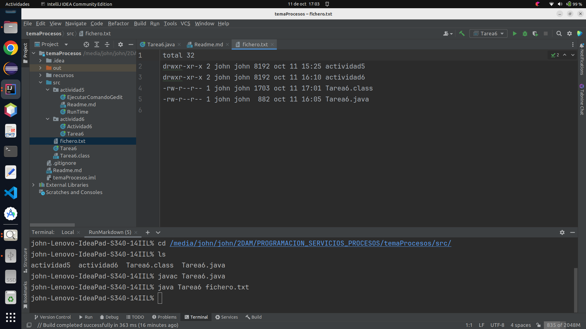

# Actividad 5

1. Buscar información de la clase Runtime de java.
   Probar a ejecutar "mspaint" desde windows o desde linux otro el gedit.

### creamos la clase *EjecutarComandoGenit*

```java
import java.io.IOException;

public class EjecutarComandoGedit {
    public static void main(String[] args) {
        abrirGenit();
    }
    public static void abrirGenit() {
        try {
            Process pGedit = Runtime.getRuntime().exec("gedit");
            System.out.println(pGedit);
        } catch (IOException e) {
            e.getLocalizedMessage();
        }
    }
}
```

Ejecutamos nuestro programa: `EjecutarComandoGedit`


2. Desde Ubuntu, Crear un programa con Runtime, que permita mostrar por pantalla toda la información
   del directorio "/etc/init.d" pasado como argumento a nuestro programa java. El padre debe mostrar en
   pantalla la ejecución del hijo con el getInputStream().

### Creamos la clase *RunTime*

```java
import java.io.BufferedReader;
import java.io.IOException;
import java.io.InputStream;
import java.io.InputStreamReader;

public class RunTime {
    public static void main(String[] args) {
        ejecutarComando();
    }
    public static void ejecutarComando() {
        try {
            Process p = Runtime.getRuntime().exec("ls /etc/init.d");
            InputStream inputStream = p.getInputStream();
            BufferedReader br = new BufferedReader(new InputStreamReader(inputStream));
            String linea = br.readLine();
            while (linea != null){
                System.out.println(linea);
                linea = br.readLine();
            }
        } catch (IOException e) {
            e.getLocalizedMessage();
        }
    }
}
```


Ejecutamos nuestro programa: `RunTime`


# Actividad 6

1. Queremos realizar un programa que haga el comando ls -l > "un_fichero.txt"
   Para ello, crear un fichero con File al que pasarás su nombre como argumento a nuestro main.
   Utilizar dos buffers, uno para la redirección del flujo de entrada al padre (lo que le devuelve el proceso hijo al padre) y otro para la escritura en un fichero desde el padre a partir del FileWriter.
   Para probar nuestro ejemplo, debemos poner algo así ./tarea6 fichero2.txt

### Creamos la clase *Tarea6*

```java
import java.io.*;

public class Tarea6 {
   public static void main(String[] args) {
      if (args.length != 1) {
         System.out.println("Uso: ./tarea6 fichero.txt");
         System.exit(1);
      }

      String filename = args[0];

      try {
         ProcessBuilder processBuilder = new ProcessBuilder("ls", "-l");
         Process process = processBuilder.start();
         InputStream inputStream = process.getInputStream();
         BufferedReader reader = new BufferedReader(new InputStreamReader(inputStream));

         FileWriter fileWriter = new FileWriter(filename);
         String line;
         while ((line = reader.readLine()) != null) {
            fileWriter.write(line + "\n");
         }
         fileWriter.close();
      } catch (IOException  e) {
         e.getLocalizedMessage();
      }
   }
}
```


Ejecutamos nuestro programa: `Tarea6`

Ejecutamos nuestro programa desde la consola con los siguientes comandos
necesita que le pasemos un argumento en este caso: *fichero.txt*

```shell
cd /home/john/Escritorio/procesos/src/      
javac tarea6/Tarea6.java              
java tarea6.Tarea6 fichero.txt

```


Se ha creado nuestro fichero *'fichero.txt'*, lo abrimos y vemos que
tiene la información que le hemos pedido al proceso hijo.





# Actividad 8

1. A partir del ejemplo visto en clase con el ping 8.8.8.8, probarlo y hacer:

   * Probarlo en windows donde el padre espere a que el hijo muera (4 ping)
   * Probarlo en linux, donde el padre muestre 10 ping del hijo y luego lo mate)
   * ¿Qué sucede si en la ejecución del hijo, el padre no lo mata?


## Probaremos el programa en linux.

### Creamos la clase *Tarea8*

```java
import java.io.BufferedReader;
import java.io.IOException;
import java.io.InputStreamReader;

public class Tarea8 {
    public static void main(String[] args) {
        Runtime runtime = Runtime.getRuntime();
        Process process = null;

        try {
            process = runtime.exec("ping " + args[0]);
            BufferedReader in = new BufferedReader(new InputStreamReader(process.getInputStream()));
            for (int i = 0; i < 10; i++) {
                System.out.println("Saludo desde PSP 23/24 " + in.readLine());
            }
        } catch (IOException e) {
            System.out.println("No pudimos correr el ping desde nuestra clase");
            System.exit(-1);
        }
        if (process!= null) {
            process.destroy();
            System.out.println("Me he cargado el ping.....");
        }
        try {
            System.out.println("Ahora esperare a que acabe mi proceso ping");
            process.waitFor();
            System.out.println("Ya no existe mi proceso ping");
        }catch (InterruptedException e) {
            System.out.println("No pudimos esperar por que termino");
            System.exit(-1);
        }
        System.out.println("Estado de termino: " + process.exitValue());
        System.exit(0);

    }
}
```
### Uso

El programa se ejecuta desde la línea de comandos y requiere un argumento que debe ser la dirección IP o el nombre de
host al que se le realizará el ping.

### Ejecutamos nuestro programa: `Tarea8`

Ejecutamos nuestro programa desde la consola con los siguientes comandos
en mi caso son estos porque mi proyecto se encuentra en el escritorio y mi programa
se encuentra en el package tarea8, le pasemos un argumento en este caso: 8.8.8.8

```shell
cd /home/john/Escritorio/procesos/src      
javac tarea8/Tarea8.java 
java tarea8/Tarea8.java 8.8.8.8

```


Este programa ejecuta el comando "ping" en un sistema operativo, en este caso linux, tomando como argumento la
dirección IP o el nombre de host proporcionado en la línea de comandos.


### Descripción

El programa utiliza la clase `Runtime` para interactuar con el sistema operativo y ejecutar el comando "ping" en una
nueva instancia de proceso. Luego, captura y muestra la salida del comando "ping" en la consola. Después de 10 líneas
de salida del "ping", se destruye el proceso "ping".

### Detalles del Programa

1. Se crea una instancia de la clase Runtime y un objeto Process para gestionar el proceso de ping.

2. El programa intenta ejecutar el comando "ping" con la dirección IP o nombre de hosts proporcionados en la línea de
   comandos. En caso de error, se muestra un mensaje y se sale del programa.

3. Se crea un objeto BufferedReader para leer la salida del proceso "ping".

4. El programa entra en un bucle que recorre 10 líneas de la salida del "ping". En cada iteración del bucle, muestra la
   línea de salida en la consola con un mensaje de saludo.

5. Después de recopilar 10 líneas de salida del "ping", el proceso "ping" se destruye.

6. El programa espera a que el proceso "ping" finalice.

7. Una vez que el proceso ha finalizado, se muestra el estado de terminación del proceso.

8. El programa sale con un código de salida apropiado.

### Observaciones

* El programa utiliza el comando "ping" para realizar un ping a la dirección IP o nombre de hosts proporcionados, y
  muestra las respuestas en la consola.
* Si el proceso "ping" no puede iniciarse, se mostrará un mensaje de error y el programa se cerrará con un código de error.
* Después de capturar 10 líneas de salida del "ping", el proceso "ping" se destruirá para finalizarlo.
* Finalmente, el programa espera a que el proceso "ping" finalice y muestra el estado de terminación del proceso.

####  ¿Qué sucede si en la ejecución del hijo, el padre no lo mata?

Si el padre no mata al proceso hijo y lo deja en ejecución, el programa se quedará en un estado de espera indefinido,
ya que la llamada `process.waitFor()` bloqueará la ejecución del padre hasta que el proceso hijo termine.

En otras palabras, si el proceso hijo no se cierra o finaliza por sí solo, el programa padre se mantendrá en espera
y no continuará ejecutando ninguna operación adicional. En este escenario, el programa quedará "atascado"
indefinidamente hasta que el proceso hijo se cierre de alguna manera, ya sea por la finalización natural de la operación
de ping o por intervención manual del usuario para finalizar el proceso.

Por lo tanto, es importante asegurarse de que el proceso hijo pueda finalizar correctamente o, en caso de ser necesario,
implementar una lógica adicional para finalizar el proceso hijo desde el padre en función de ciertas condiciones o
límites de tiempo, para evitar que el programa quede bloqueado en un estado de espera indefinido.


# Actividad 9

1. A partir del ejercicio anterior y en linux, dormir al padre por 3 segundos y transcurridos matar al hijo.


### Creamos la clase *Tarea9*

```java
import java.io.BufferedReader;
import java.io.IOException;
import java.io.InputStreamReader;

public class Tarea9 {
   public static void main(String[] args) {
      Runtime runtime = Runtime.getRuntime();
      Process process = null;

      try {
         process = runtime.exec("ping " + args[0]);
         BufferedReader in = new BufferedReader(new InputStreamReader(process.getInputStream()));
         for (int i = 0; i < 10; i++) {
            System.out.println("Saludo desde PSP 23/24 " + in.readLine());
         }

      } catch (IOException e) {
         System.out.println("No pudimos correr el ping desde nuestra clase");
         System.exit(-1);
      }

      // Dormir al padre durante 3 segundos
      try {
         Thread.sleep(3000);

         // Matar al proceso hijo
         process.destroy();
         System.out.println("El proceso hijo ha sido terminado.");
      } catch (InterruptedException e) {
         throw new RuntimeException(e);
      }
   }
}
```
### Uso

El programa se ejecuta desde la línea de comandos y requiere un argumento que debe ser la dirección IP o el nombre de
host al que se le realizará el ping.

Ejecutamos nuestro programa: `Tarea9`

Ejecutamos nuestro programa desde la consola con los siguientes comandos
en mi caso son estos porque mi proyecto se encuentra en el escritorio y mi programa
se encuentra en el package tarea9, le pasemos un argumento en este caso: 8.8.8.8

```shell
cd /home/john/Escritorio/procesos/src      
javac tarea9/Tarea9.java 
java tarea9/Tarea9.java 8.8.8.8

```


Este programa ejecuta el comando "ping" en un sistema operativo, tomando como argumento la
dirección IP o el nombre de host proporcionado en la línea de comandos.


### Descripción

El programa utiliza la clase `Runtime` para interactuar con el sistema operativo y ejecutar el comando "ping" en una
nueva instancia de proceso. Luego, captura y muestra la salida del comando "ping" en la consola. Después de 10 líneas
de salida del "ping", podremos a dormir al proceso padre y luego destruye el proceso "ping".

### Detalles del Programa

1. Se crea una instancia de la clase Runtime y un objeto Process para gestionar el proceso de ping.

2. El programa intenta ejecutar el comando "ping" con la dirección IP o nombre de hosts proporcionados en la línea de
   comandos. En caso de error, se muestra un mensaje y se sale del programa.

3. Se crea un objeto BufferedReader para leer la salida del proceso "ping".

4. El programa entra en un bucle que recorre 10 líneas de la salida del "ping". En cada iteración del bucle, muestra la
   línea de salida en la consola con un mensaje de saludo y las respuestas del ping.

5. Después de recopilar 10 líneas de salida del "ping", ponemos a dormir al proceso padre por 3 segundo.

6. Pasados los tres segundos, el proceso padre mata al proceso hijo.

7. Se muestra el mensaje que el proceso hijo ha finalizado.

### Observaciones

* El programa utiliza el comando "ping" para realizar un ping a la dirección IP o nombre de hosts proporcionados, y
  muestra las respuestas en la consola.
* Si el proceso "ping" no puede iniciarse, se mostrará un mensaje de error y el programa se cerrará con un código de error.
* Después de capturar 10 líneas de salida del "ping", dormiremos al proceso padre tres segundos, transcurridos los tres
  segundos el proceso padre destruirá al proceso hijo.
* Finalmente, el programa muestra el estado de terminación del proceso.


# Actividad 10

1. Crear un clon del ls -l del realizado con el Runtime, pero ahora con el ProcessBuilder.
2. ¿Qué sucede si el comando se lo pasamos de la forma "ls -l"?

## Crear un clon del ls -l del realizado con el Runtime, pero ahora con el ProcessBuilder.

### creamos la clase *RunTimeProcessBuilder*

```java
import java.io.BufferedReader;
import java.io.IOException;
import java.io.InputStreamReader;

public class RunTimeProcessBuilder {
    public static void main(String[] args) {

        try {
            // Crear un objeto ProcessBuilder para ejecutar el comando "ls -l"
            ProcessBuilder processBuilder = new ProcessBuilder("ls","-l");
            // Iniciar el proceso
            Process process = processBuilder.start();

            // Capturar la salida del comando "ls -l"
            BufferedReader reader = new BufferedReader(new InputStreamReader(process.getInputStream()));
            String line;
            // Leer y mostrar la salida línea por línea
            while ((line = reader.readLine()) != null) {
                System.out.println(line);
            }

            // Esperar a que el proceso hijo termine
            process.waitFor();
            System.out.println("El comando 'ls -l' ha finalizado.");
        } catch (IOException | InterruptedException e) {
            e.printStackTrace();
        }
    }
}
```

Ejecutamos nuestro programa: `RunTimeProcessBuilder`


Este programa utiliza ProcessBuilder para ejecutar el comando ls -l, captura su salida y muestra los resultados en la
consola.

## ¿Qué sucede si el comando se lo pasamos de la forma "ls -l"?

El constructor de ProcessBuilder espera que los argumentos se pasen como elementos separados en la lista, no como
una única cadena con espacios. Al usar "ls -l" como una sola cadena, el comando no se interpreta correctamente.

El enfoque correcto es pasar "ls" y "-l" como argumentos separados:

```
ProcessBuilder processBuilder = new ProcessBuilder("ls", "-l");
```


# Actividad 12

1. A partir del ejemplo visto en clase con el comando find y el ProcessBuilder, probarlo con un tiempo de espera pasado como argumento desde el main la ruta a buscar, la extensión de los ficheros y el tiempo de espera máximo en segundos a esperar desde el padre. Transcurridos los 2000 milisegundos, el padre deberá matar al hijo. Para probar diferentes opciones, probar a que la búsqueda sea mayor a los 2 segundos.

   * la ejecución deberá ser algo como /java ejemplo_find /home/<usuario> class 2
   * El comando a ejecutar sería tal como find /home/santi  -name "*.class" 2000

### Creamos la clase *Tarea12*

```java
import java.io.IOException;
import java.util.concurrent.TimeUnit;

public class Tarea12 {
    public static void main(String[] args) {
        if (args.length != 3) {
            System.out.println("Uso:  <ruta> <extensión> <tiempo en segundos>");
            System.exit(1);
        }

        String ruta = args[0];
        String extension = args[1];
        int tiempoEspera = Integer.parseInt(args[2]) * 1000; // Convierte segundos a milisegundos

        ProcessBuilder processBuilder = new ProcessBuilder("find", ruta, "-name", "*." + extension);
        System.out.println("Como proceso actual, voy a ejecutar un comando find por un tiempo" +
                "mediante otro proceso\n");
        processBuilder.inheritIO(); //El proceso actual y el nuevo, utilizan las mismas E/S
        processBuilder.redirectErrorStream(true);// para que no salgan las salidas y errores mezclados
        try {
            Process p = processBuilder.start();//Lanzamos el nuevo proceso
            if (!p.waitFor(tiempoEspera, TimeUnit.MILLISECONDS)) {
                p.destroy();//matamos al proceso hijo.
                /*
                    whaitfor() devuelve true si el nuevo proceso
                    ha terminado el mismo antes del tiempo indicado
                */
                System.out.println("\nEl proceso lanzado no ha finalizado a tiempo su ejecucion\n");
            }
            System.out.println("El proceso lanzado ha finalizado a tiempo su ejecucion");
        } catch (IOException  e) {
            System.out.println("Error al intentar lanzar un nuevo proceso. pedimos informacion detallada\n");
            e.printStackTrace();
            System.exit(1);//error en el proceso
        }catch(InterruptedException e){
            System.out.println("El proceso ha sido interrumpido mediante interrumpción\n");
            System.exit(2);
        }
    }
}
```
### Uso

El programa se ejecuta desde la línea de comandos y requiere tres argumentos que debe ser la ruta la extension y los
segundos.

Ejecutamos nuestro programa: `Tarea12`

Ejecutamos nuestro programa desde la consola con los siguientes comandos
necesita que le pasemos tres argumentos en este caso: ruta /home/john
la extension class y el tiempo 2

```shell
cd /home/john/Escritorio/procesos/src/      
javac tarea12/Tarea12.java              
java tarea12/Tarea12.java /home/john class 2   

```


Como podemos ver en la imagen anterior con tiempo 2 el proceso hijo termina antes del que padre lo mate.

Ahora lo ejecutaremos con menos tiempo: /home/john class 1

```shell
cd /home/john/Escritorio/procesos/src/      
javac tarea12/Tarea12.java              
java tarea12/Tarea12.java /home/john class 1   

```


Como podemos ver en la imagen anterior con tiempo 1 el proceso hijo no termina antes del que padre lo mate.

### Detalles del programa:

1. El programa espera tres argumentos desde la línea de comandos: <ruta>, <extensión>, y <tiempo en segundos>. Estos
   argumentos se utilizan para configurar la búsqueda y el tiempo de espera.

2. Se convierte el tiempo de espera de segundos a milisegundos, ya que el método p.waitFor espera en milisegundos.

3. Se crea un objeto ProcessBuilder para ejecutar el comando find con los argumentos proporcionados.

4. processBuilder.inheritIO() se utiliza para que el proceso actual y el nuevo proceso compartan las mismas entradas y
   salidas estándar. Esto significa que las salidas del proceso hijo se mostrarán en la consola del proceso actual.

5. processBuilder.redirectErrorStream(true) se utiliza para redirigir las salidas de error al flujo de salida estándar,
   evitando que las salidas y los errores se mezclen.

6. Se inicia el nuevo proceso con processBuilder.start().

7. El programa espera el tiempo especificado utilizando p.waitFor(tiempoEspera, TimeUnit.MILLISECONDS). Si el proceso
   hijo no ha finalizado dentro del tiempo especificado, se mata utilizando p.destroy().

8. El programa maneja las excepciones IOException y InterruptedException que puedan surgir durante la ejecución del
   proceso hijo. Si se produce un error, se muestra un mensaje de error y se sale del programa con un código de error
   apropiado.

En resumen, este programa ejecuta el comando find en un proceso hijo y verifica si el proceso hijo finaliza dentro del
tiempo especificado. Si el proceso no finaliza a tiempo, se mata y se muestra un mensaje de error.

Dejeo el enlace al repositorio
[https://github.com/johnlopez0505/procesos.git](https://github.com/johnlopez0505/procesos.git)