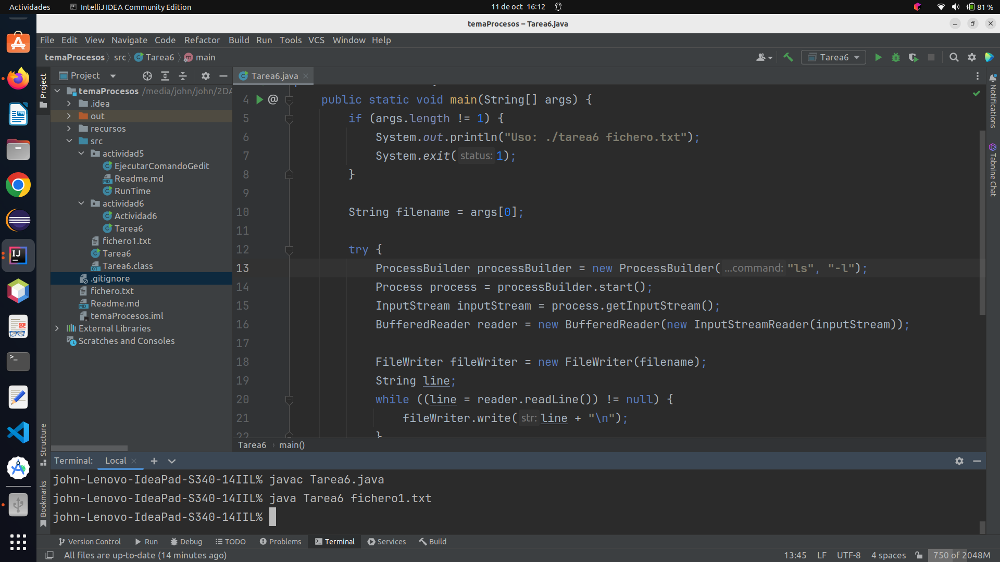

# Actividad 5

1. Buscar información de la clase Runtime de java.
   Probar a ejecutar "mspaint" desde windows o desde linux otro el gedit.

### creamos la clase *EjecutarComandoGenit*

```java
import java.io.IOException;

public class EjecutarComandoGedit {
    public static void main(String[] args) {
        abrirGenit();
    }
    public static void abrirGenit() {
        try {
            Process pGedit = Runtime.getRuntime().exec("gedit");
            System.out.println(pGedit);
        } catch (IOException e) {
            e.getLocalizedMessage();
        }
    }
}
```

Ejecutamos nuestro programa: `EjecutarComandoGedit`


2. Desde Ubuntu, Crear un programa con Runtime, que permita mostrar por pantalla toda la información
   del directorio "/etc/init.d" pasado como argumento a nuestro programa java. El padre debe mostrar en
   pantalla la ejecución del hijo con el getInputStream().

### Creamos la clase *RunTime*

```java
import java.io.BufferedReader;
import java.io.IOException;
import java.io.InputStream;
import java.io.InputStreamReader;

public class RunTime {
    public static void main(String[] args) {
        ejecutarComando();
    }
    public static void ejecutarComando() {
        try {
            Process p = Runtime.getRuntime().exec("ls /etc/init.d");
            InputStream inputStream = p.getInputStream();
            BufferedReader br = new BufferedReader(new InputStreamReader(inputStream));
            String linea = br.readLine();
            while (linea != null){
                System.out.println(linea);
                linea = br.readLine();
            }
        } catch (IOException e) {
            e.getLocalizedMessage();
        }
    }
}
```


Ejecutamos nuestro programa: `RunTime`


# Actividad 6

1. Queremos realizar un programa que haga el comando ls -l > "un_fichero.txt"
   Para ello, crear un fichero con File al que pasarás su nombre como argumento a nuestro main.
   Utilizar dos buffers, uno para la redirección del flujo de entrada al padre (lo que le devuelve el proceso hijo al padre) y otro para la escritura en un fichero desde el padre a partir del FileWriter.
   Para probar nuestro ejemplo, debemos poner algo así ./tarea6 fichero2.txt

### Creamos la clase *Tarea6*

```java
import java.io.*;

public class Tarea6 {
   public static void main(String[] args) {
      if (args.length != 1) {
         System.out.println("Uso: ./tarea6 fichero.txt");
         System.exit(1);
      }

      String filename = args[0];

      try {
         ProcessBuilder processBuilder = new ProcessBuilder("ls", "-l");
         Process process = processBuilder.start();
         InputStream inputStream = process.getInputStream();
         BufferedReader reader = new BufferedReader(new InputStreamReader(inputStream));

         FileWriter fileWriter = new FileWriter(filename);
         String line;
         while ((line = reader.readLine()) != null) {
            fileWriter.write(line + "\n");
         }
         fileWriter.close();
      } catch (IOException  e) {
         e.getLocalizedMessage();
      }
   }
}
```


Ejecutamos nuestro programa: `Tarea6`

Ejecutamos nuestro programa desde la consola con los siguientes comandos
necesita que le pasemos un argumento en este caso: *fichero.txt*

```shell
cd /home/john/Escritorio/procesos/src/      
javac tarea6/Tarea6.java              
java tarea6.Tarea6 fichero.txt

```



Se ha creado nuestro fichero *'fichero.txt'*, lo abrimos y vemos que
tiene la información que le hemos pedido al proceso hijo.


