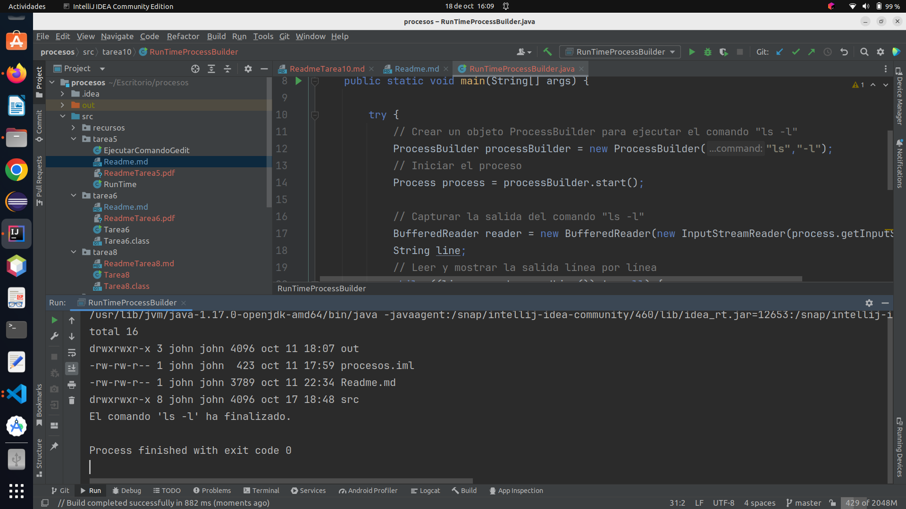

# Actividad 10
1. Crear un clon del ls -l del realizado con el Runtime, pero ahora con el ProcessBuilder.
2. ¿Qué sucede si el comando se lo pasamos de la forma "ls -l"?

## Crear un clon del ls -l del realizado con el Runtime, pero ahora con el ProcessBuilder.

### creamos la clase *RunTimeProcessBuilder*

```java
import java.io.BufferedReader;
import java.io.IOException;
import java.io.InputStreamReader;

public class RunTimeProcessBuilder {
    public static void main(String[] args) {

        try {
            // Crear un objeto ProcessBuilder para ejecutar el comando "ls -l"
            ProcessBuilder processBuilder = new ProcessBuilder("ls","-l");
            // Iniciar el proceso
            Process process = processBuilder.start();

            // Capturar la salida del comando "ls -l"
            BufferedReader reader = new BufferedReader(new InputStreamReader(process.getInputStream()));
            String line;
            // Leer y mostrar la salida línea por línea
            while ((line = reader.readLine()) != null) {
                System.out.println(line);
            }

            // Esperar a que el proceso hijo termine
            process.waitFor();
            System.out.println("El comando 'ls -l' ha finalizado.");
        } catch (IOException | InterruptedException e) {
            e.printStackTrace();
        }
    }
}
```

Ejecutamos nuestro programa: `RunTimeProcessBuilder`




Este programa utiliza ProcessBuilder para ejecutar el comando ls -l, captura su salida y muestra los resultados en la 
consola.

## ¿Qué sucede si el comando se lo pasamos de la forma "ls -l"?

El constructor de ProcessBuilder espera que los argumentos se pasen como elementos separados en la lista, no como 
una única cadena con espacios. Al usar "ls -l" como una sola cadena, el comando no se interpreta correctamente.

El enfoque correcto es pasar "ls" y "-l" como argumentos separados:

```
ProcessBuilder processBuilder = new ProcessBuilder("ls", "-l");
```

#### Dejo el enlace al repositorio
[https://github.com/johnlopez0505/procesos.git](https://github.com/johnlopez0505/procesos.git)


