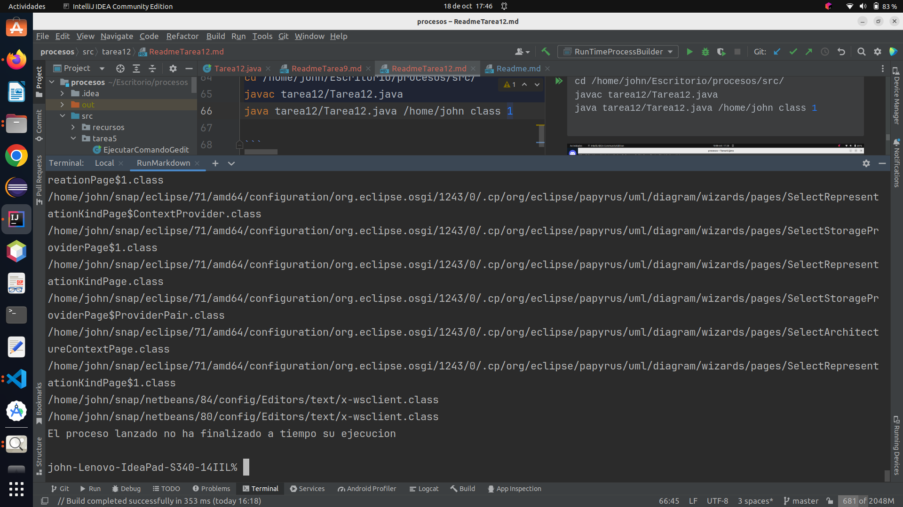

# Actividad 12

1. A partir del ejemplo visto en clase con el comando find y el ProcessBuilder, probarlo con un tiempo de espera pasado como argumento desde el main la ruta a buscar, la extensión de los ficheros y el tiempo de espera máximo en segundos a esperar desde el padre. Transcurridos los 2000 milisegundos, el padre deberá matar al hijo. Para probar diferentes opciones, probar a que la búsqueda sea mayor a los 2 segundos.

    * la ejecución deberá ser algo como /java ejemplo_find /home/<usuario> class 2
    * El comando a ejecutar sería tal como find /home/santi  -name "*.class" 2000 

### Creamos la clase *Tarea12*

```java
import java.io.IOException;
import java.util.concurrent.TimeUnit;

public class Tarea12 {
    public static void main(String[] args) {
        if (args.length != 3) {
            System.out.println("Uso:  <ruta> <extensión> <tiempo en segundos>");
            System.exit(1);
        }

        String ruta = args[0];
        String extension = args[1];
        int tiempoEspera = Integer.parseInt(args[2]) * 1000; // Convierte segundos a milisegundos

        ProcessBuilder processBuilder = new ProcessBuilder("find", ruta, "-name", "*." + extension);
        System.out.println("Como proceso actual, voy a ejecutar un comando find por un tiempo" +
                "mediante otro proceso\n");
        processBuilder.inheritIO(); //El proceso actual y el nuevo, utilizan las mismas E/S
        processBuilder.redirectErrorStream(true);// para que no salgan las salidas y errores mezclados
        try {
            Process p = processBuilder.start();//Lanzamos el nuevo proceso
            if (!p.waitFor(tiempoEspera, TimeUnit.MILLISECONDS)) {
                p.destroy();//matamos al proceso hijo.
                /*
                    whaitfor() devuelve true si el nuevo proceso
                    ha terminado el mismo antes del tiempo indicado
                */
                System.out.println("\nEl proceso lanzado no ha finalizado a tiempo su ejecucion\n");
            }
            System.out.println("El proceso lanzado ha finalizado a tiempo su ejecucion");
        } catch (IOException  e) {
            System.out.println("Error al intentar lanzar un nuevo proceso. pedimos informacion detallada\n");
            e.printStackTrace();
            System.exit(1);//error en el proceso
        }catch(InterruptedException e){
            System.out.println("El proceso ha sido interrumpido mediante interrumpción\n");
            System.exit(2);
        }
    }
}
```
### Uso

El programa se ejecuta desde la línea de comandos y requiere tres argumentos que debe ser la ruta la extension y los
segundos.

Ejecutamos nuestro programa: `Tarea12`

Ejecutamos nuestro programa desde la consola con los siguientes comandos
necesita que le pasemos tres argumentos en este caso: ruta /home/john 
la extension class y el tiempo 2 

```shell
cd /home/john/Escritorio/procesos/src/      
javac tarea12/Tarea12.java              
java tarea12/Tarea12.java /home/john class 2   

```


Como podemos ver en la imagen anterior con tiempo 2 el proceso hijo termina antes del que padre lo mate.

Ahora lo ejecutaremos con menos tiempo: /home/john class 1

```shell
cd src/      
javac tarea15/Tarea15.java              
java tarea15.Tarea15.java /home/john class 1   

```   



Como podemos ver en la imagen anterior con tiempo 1 el proceso hijo no termina antes del que padre lo mate.

### Detalles del programa:

1. El programa espera tres argumentos desde la línea de comandos: <ruta>, <extensión>, y <tiempo en segundos>. Estos 
argumentos se utilizan para configurar la búsqueda y el tiempo de espera.

2. Se convierte el tiempo de espera de segundos a milisegundos, ya que el método p.waitFor espera en milisegundos. 

3. Se crea un objeto ProcessBuilder para ejecutar el comando find con los argumentos proporcionados.

4. processBuilder.inheritIO() se utiliza para que el proceso actual y el nuevo proceso compartan las mismas entradas y 
salidas estándar. Esto significa que las salidas del proceso hijo se mostrarán en la consola del proceso actual.

5. processBuilder.redirectErrorStream(true) se utiliza para redirigir las salidas de error al flujo de salida estándar, 
evitando que las salidas y los errores se mezclen.

6. Se inicia el nuevo proceso con processBuilder.start(
7. El programa espera el tiempo especificado utilizando p.waitFor(tiempoEspera, TimeUnit.MILLISECONDS). Si el proceso 
hijo no ha finalizado dentro del tiempo especificado, se mata utilizando p.destroy().

8. El programa maneja las excepciones IOException y InterruptedException que puedan surgir durante la ejecución del 
proceso hijo. Si se produce un error, se muestra un mensaje de error y se sale del programa con un código de error 
apropiado.

En resumen, este programa ejecuta el comando find en un proceso hijo y verifica si el proceso hijo finaliza dentro del 
tiempo especificado. Si el proceso no finaliza a tiempo, se mata y se muestra un mensaje de error.

#### Dejo el enlace al repositorio
[https://github.com/johnlopez0505/procesos.git](https://github.com/johnlopez0505/procesos.git)
