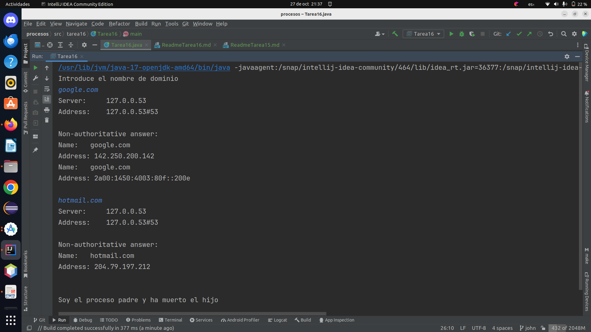

# Actividad 16

1. Modificar el ejemplo del nslookup visto en clase (el de la presentación), utilizando las clases Scanner y 
   PrintWriter. Utilizar la redirección de salida, para que ambos procesos escriban en pantalla.
* Que el hijo herede la salida del padre, para ver en todo momento lo que sucede.
* Utilizar la clase Scanner, para leer desde teclado los dominios que el padre debe pasar al hijo. 
* Utilizar el PrintWriter, para conectar la salida del padre con la entrada del hijo. (Para pasarle los dominios)

El programa **Tarea16** se utiliza para realizar búsquedas de información de servidores DNS utilizando el comando 
`nslookup`. El programa permite al usuario introducir un nombre de dominio y realiza consultas DNS utilizando 
dicho nombre. A continuación, se proporciona una descripción detallada del programa:

Creamos la clase `Tarea16`:


```java
public class Tarea16 {
    public static void main(String[] args) {
        ProcessBuilder pb = new ProcessBuilder("nslookup");
        pb.redirectOutput(ProcessBuilder.Redirect.INHERIT);
        System.out.println("Introduce el nombre de dominio");
        Scanner sc = new Scanner(System.in);
        String linea;
        Process p = null;
        try {
            while(((linea = sc.nextLine()) != null) && linea.length() != 0) {
                p = pb.start();
                PrintWriter out = new PrintWriter(p.getOutputStream());
                out.println(linea);
                out.close();
            }
        try {
            p.waitFor();
            System.out.println("Soy el proceso padre y ha muerto el hijo");
        } catch (InterruptedException e) {
            System.out.println("Se ha interrumpido el proceso");
        }
        } catch (Exception e) {
            System.out.println("Algo ha petado");
        }
    }
}

```
Imagen de ejecucion del programa:


## Descripción del Programa

- `ProcessBuilder pb = new ProcessBuilder("nslookup");`: Se crea un objeto `ProcessBuilder` que se utiliza para 
   ejecutar el comando `nslookup`. `ProcessBuilder` permite iniciar un nuevo proceso y gestionar sus entradas/salidas.

- `pb.redirectOutput(ProcessBuilder.Redirect.INHERIT);`: Esta línea redirige la salida del proceso hijo a la salida
   estándar del proceso actual. Esto significa que cualquier salida generada por el proceso `nslookup` se mostrará 
   directamente en la consola.

- `Scanner sc = new Scanner(System.in);`: Se crea un objeto `Scanner` para leer la entrada del usuario desde la consola.

- `String linea;`: Se declara una variable `linea` que se utilizará para almacenar la entrada del usuario.

- `Process p = null;`: Se declara una variable `p` para representar el proceso hijo, inicialmente establecida como nula.

- El programa entra en un bucle `while` que continuará ejecutándose mientras el usuario introduzca líneas de entrada.
  El bucle se ejecuta de la siguiente manera:
    - `linea = sc.nextLine()`: Lee una línea de entrada del usuario y la almacena en la variable `linea`.
    - `p = pb.start();`: Se inicia un nuevo proceso utilizando el comando `nslookup`. Este proceso se ejecuta en 
       paralelo con el programa actual.

    - `PrintWriter out = new PrintWriter(p.getOutputStream());`: Se crea un objeto `PrintWriter` para escribir datos 
       en la entrada del proceso hijo. Esto permite enviar el nombre de dominio introducido por el usuario al 
       proceso `nslookup`.

    - `out.println(linea);`: Se escribe la línea introducida por el usuario en la entrada del proceso `nslookup`.

    - `out.close();`: Se cierra el `PrintWriter` después de escribir la línea.

- Después de que el usuario deje de introducir líneas, el programa sale del bucle `while`.

- A continuación, el programa espera a que el proceso hijo (`nslookup`) termine utilizando `p.waitFor()`. 
  Durante este tiempo, el programa se bloquea hasta que el proceso hijo finalice.

- Finalmente, se muestra un mensaje que indica que el proceso padre ha detectado que el proceso hijo ha terminado 
  o se ha interrumpido en caso de error.

- El programa maneja las excepciones en caso de errores y muestra mensajes adecuados en función del tipo de error.

El programa básicamente permite a un usuario ejecutar consultas `nslookup` ingresando nombres de dominio y ver la 
salida de esas consultas en la consola.

Es importante mencionar que la interacción con la línea de comandos en tiempo real se realiza mediante el proceso hijo 
y la comunicación a través de `ProcessBuilder`, que permite ejecutar comandos en un sistema operativo desde una aplicación Java.

#### Dejo el enlace al repositorio
[https://github.com/johnlopez0505/procesos.git](https://github.com/johnlopez0505/procesos.git)
