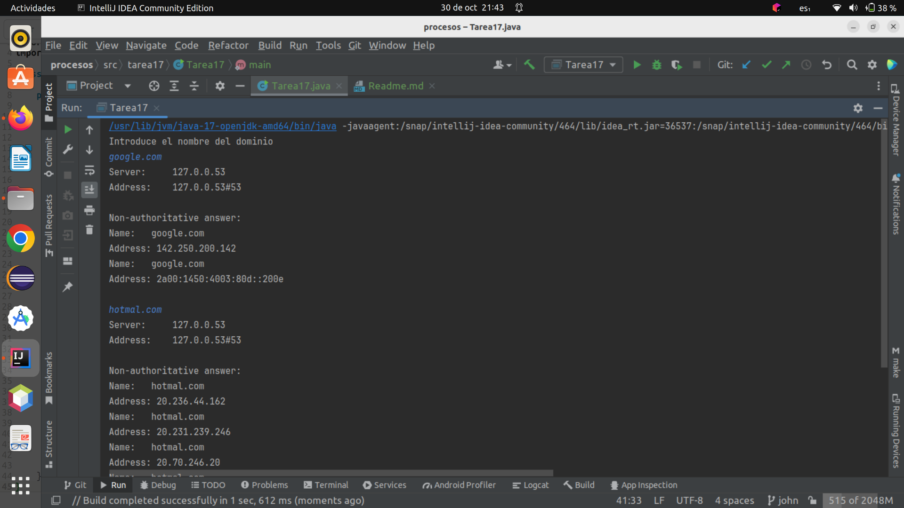

# Tarea 17

Modificar el ejemplo del nslookup anterior, sin que se herede la salida del padre al hijo. Obtener desde el hijo, 
su inputStream hacia el padre para que muestre los resultados por pantalla. Recordar cerrar el flujo de salida del 
subproceso.

Creamos la clase `Tarea17`:

```java
public class Tarea17 {
    public static void main(String[] args) throws IOException {
        // Configuracion ProcessBuilder utilizando el comando "nslookup"
        ProcessBuilder pb = new ProcessBuilder("nslookup");
        try {
            InputStreamReader isrin = new InputStreamReader(System.in, "UTF-8");
            BufferedReader brin = new BufferedReader(isrin);
            String linea;
            System.out.println("Introduce el nombre del dominio");
            Process p = null;
            while ((linea = brin.readLine()) != null && linea.length() != 0) {
                // Iniciar el proceso "nslookup"
                p = pb.start();
                try {
                    // Configurar la salida del proceso para enviar la entrada del usuario
                    OutputStream osp = p.getOutputStream();
                    OutputStreamWriter oswp = new OutputStreamWriter(osp, "UTF-8");
                    oswp.write(linea);
                    oswp.close();

                    // Leer la salida del proceso "nslookup"
                    InputStream isp = p.getInputStream();
                    InputStreamReader isrp = new InputStreamReader(isp, "UTF-8");
                    BufferedReader br = new BufferedReader(isrp);
                    String linea2;
                    while ((linea2 = br.readLine()) != null) {
                        // Mostrar la salida del proceso "nslookup"
                        System.out.println(linea2);
                    }
                } catch (UnsupportedEncodingException e) {
                    System.out.println(e.getMessage());
                }
            }
            try {
                // Esperar a que el proceso hijo termine
                p.waitFor();
                System.out.println("Proceso hijo termino correctamente");
            } catch (InterruptedException e) {
                System.out.println(e.getMessage());;
            }

        }catch (IOException e){
            System.out.println("Error: E/S");
            System.out.println(e.getMessage());
        }
    }
}

```

Ejecutamos el programa:




Se crea un ProcessBuilder llamado pb para ejecutar el comando "nslookup". Este proceso se utilizará para realizar 
búsquedas de DNS.

Se configura un lector de entrada estándar (System.in) para recibir la entrada del usuario. Se crea un lector de entrada
(InputStreamReader) y un BufferedReader para leer la entrada del usuario.

El programa entra en un bucle while que permite al usuario ingresar nombres de dominio para buscar en el servidor DNS. 
Cada nombre de dominio se almacena en la variable linea.

Dentro del bucle, se inicia el proceso "nslookup" utilizando pb.start(). Esto permite ejecutar comandos en un proceso 
separado.

Se configura la salida del proceso para que coincida con la entrada proporcionada por el usuario. El nombre de dominio 
ingresado se escribe en la salida del proceso.

Se configura un lector de entrada para capturar la salida del proceso "nslookup". Esto se hace para que el programa 
pueda leer y mostrar la información de DNS que se recibe.

Se lee la salida línea por línea y se muestra en la consola del usuario.

El programa controla excepciones, como problemas de codificación o interrupciones del proceso.

Después de que el usuario haya terminado de ingresar nombres de dominio, se espera a que el proceso hijo "nslookup" 
termine utilizando p.waitFor().

El programa muestra un mensaje indicando que el proceso hijo ha terminado correctamente.

Si se produce algún error de E/S durante la ejecución, el programa captura la excepción y muestra un mensaje de error.