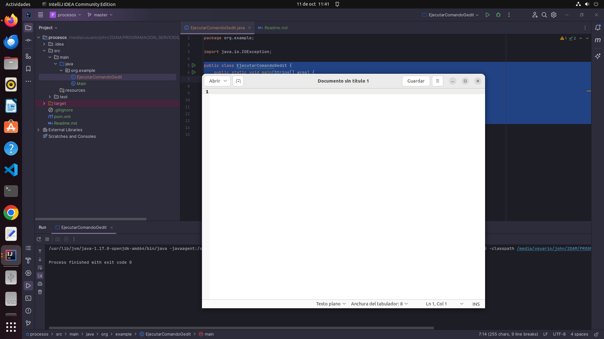
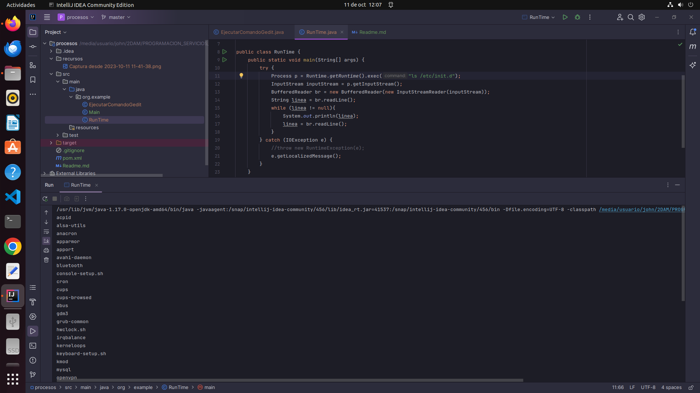

# Actividad 5

1. Buscar información de la clase Runtime de java. 
Probar a ejecutar "mspaint" desde windows o desde linux otro el gedit.

### creamos la clase *EjecutarComandoGenit*

```java
import java.io.IOException;

public class EjecutarComandoGedit {
    public static void main(String[] args) {
        abrirGenit();
    }
    public static void abrirGenit() {
        try {
            Process pGedit = Runtime.getRuntime().exec("gedit");
            System.out.println(pGedit);
        } catch (IOException e) {
            e.getLocalizedMessage();
        }
    }
}
```

Ejecutamos nuestro programa: `EjecutarComandoGedit`   





2. Desde Ubuntu, Crear un programa con Runtime, que permita mostrar por pantalla toda la información 
del directorio "/etc/init.d" pasado como argumento a nuestro programa java. El padre debe mostrar en 
pantalla la ejecución del hijo con el getInputStream().

### Creamos la clase *RunTime*

```java
import java.io.BufferedReader;
import java.io.IOException;
import java.io.InputStream;
import java.io.InputStreamReader;

public class RunTime {
    public static void main(String[] args) {
        ejecutarComando();
    }
    public static void ejecutarComando() {
        try {
            Process p = Runtime.getRuntime().exec("ls /etc/init.d");
            InputStream inputStream = p.getInputStream();
            BufferedReader br = new BufferedReader(new InputStreamReader(inputStream));
            String linea = br.readLine();
            while (linea != null){
                System.out.println(linea);
                linea = br.readLine();
            }
        } catch (IOException e) {
            e.getLocalizedMessage();
        }
    }
}
```


Ejecutamos nuestro programa: `RunTime` 


