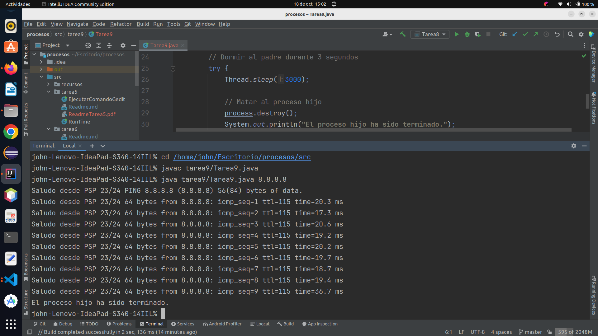

# Actividad 9

1. A partir del ejercicio anterior y en linux, dormir al padre por 3 segundos y transcurridos matar al hijo.


### Creamos la clase *Tarea9*

```java
import java.io.BufferedReader;
import java.io.IOException;
import java.io.InputStreamReader;

public class Tarea9 {
   public static void main(String[] args) {
      Runtime runtime = Runtime.getRuntime();
      Process process = null;

      try {
         process = runtime.exec("ping " + args[0]);
         BufferedReader in = new BufferedReader(new InputStreamReader(process.getInputStream()));
         for (int i = 0; i < 10; i++) {
            System.out.println("Saludo desde PSP 23/24 " + in.readLine());
         }

      } catch (IOException e) {
         System.out.println("No pudimos correr el ping desde nuestra clase");
         System.exit(-1);
      }

      // Dormir al padre durante 3 segundos
      try {
         Thread.sleep(3000);

         // Matar al proceso hijo
         process.destroy();
         System.out.println("El proceso hijo ha sido terminado.");
      } catch (InterruptedException e) {
         throw new RuntimeException(e);
      }
   }
}
```
### Uso

El programa se ejecuta desde la línea de comandos y requiere un argumento que debe ser la dirección IP o el nombre de 
host al que se le realizará el ping.

Ejecutamos nuestro programa: `Tarea9`

Ejecutamos nuestro programa desde la consola con los siguientes comandos
en mi caso son estos porque mi proyecto se encuentra en el escritorio y mi programa 
se encuentra en el package tarea9, le pasemos un argumento en este caso: 8.8.8.8

```shell
cd /home/john/Escritorio/procesos/src      
javac tarea9/Tarea9.java 
java tarea9/Tarea9.java 8.8.8.8

```




Este programa ejecuta el comando "ping" en un sistema operativo, tomando como argumento la 
dirección IP o el nombre de host proporcionado en la línea de comandos.


### Descripción

El programa utiliza la clase `Runtime` para interactuar con el sistema operativo y ejecutar el comando "ping" en una 
nueva instancia de proceso. Luego, captura y muestra la salida del comando "ping" en la consola. Después de 10 líneas 
de salida del "ping", podremos a dormir al proceso padre y luego destruye el proceso "ping".

### Detalles del Programa

1. Se crea una instancia de la clase Runtime y un objeto Process para gestionar el proceso de ping.

2. El programa intenta ejecutar el comando "ping" con la dirección IP o nombre de hosts proporcionados en la línea de 
comandos. En caso de error, se muestra un mensaje y se sale del programa.

3. Se crea un objeto BufferedReader para leer la salida del proceso "ping".

4. El programa entra en un bucle que recorre 10 líneas de la salida del "ping". En cada iteración del bucle, muestra la 
línea de salida en la consola con un mensaje de saludo y las respuestas del ping.

5. Después de recopilar 10 líneas de salida del "ping", ponemos a dormir al proceso padre por 3 segundo.

6. Pasados los tres segundos, el proceso padre mata al proceso hijo.

7. Se muestra el mensaje que el proceso hijo ha finalizado.

### Observaciones

* El programa utiliza el comando "ping" para realizar un ping a la dirección IP o nombre de hosts proporcionados, y 
   muestra las respuestas en la consola. 
* Si el proceso "ping" no puede iniciarse, se mostrará un mensaje de error y el programa se cerrará con un código de error. 
* Después de capturar 10 líneas de salida del "ping", dormiremos al proceso padre tres segundos, transcurridos los tres 
segundos el proceso padre destruirá al proceso hijo. 
* Finalmente, el programa muestra el estado de terminación del proceso.


#### Dejo el enlace al repositorio
[https://github.com/johnlopez0505/procesos.git](https://github.com/johnlopez0505/procesos.git)