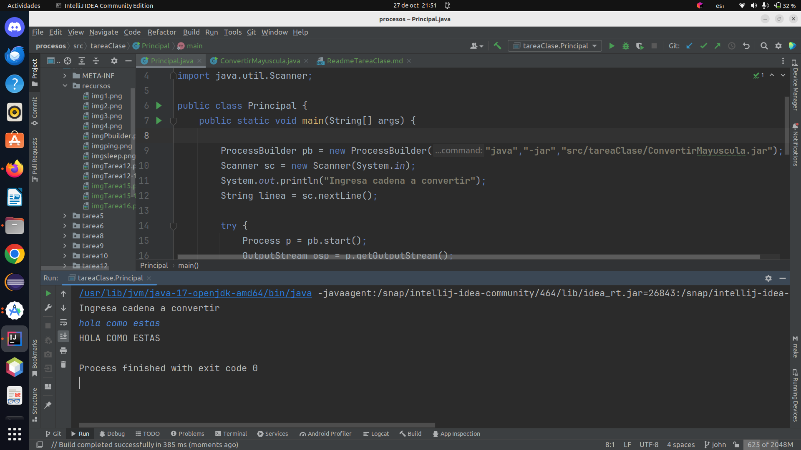

# Crear un programa completo, compuesto por dos ficheros java, uno que sea el principal y otro que sea un jar.
* La idea es sencilla. Desde el programa principal, se leerá un texto por teclado y se creará un subproceso 
  mediante la llamada a otro fichero jar, llamado convertir-mayusculas.jar. Dicho jar deberá leer de su flujo
  de entrada dicho texto y devolverle al principal ese mismo texto convertido a mayúsculas.

Creamos la clase **Principal**:

```java
public class Principal {
    public static void main(String[] args) {

        ProcessBuilder pb = new ProcessBuilder("java","-jar","src/tareaClase/ConvertirMayuscula.jar");
        Scanner sc = new Scanner(System.in);
        System.out.println("Ingresa cadena a convertir");
        String linea = sc.nextLine();

        try {
            Process p = pb.start();
            OutputStream osp = p.getOutputStream();
            OutputStreamWriter osw = new OutputStreamWriter(osp);
            osw.write(linea);
            osw.close();

            InputStream isp = p.getInputStream();
            InputStreamReader isr = new InputStreamReader(isp);
            BufferedReader br = new BufferedReader(isr);
            String linea2 = br.readLine();
            System.out.println(linea2);
            br.close();

            p.waitFor();
        }catch (IOException | InterruptedException e){
            e.getStackTrace();
        }
    }
}
```

Creamos la clase **CovertirMayuscula**:

```java
public class ConvertirMayuscula {
    public static void main(String[] args) {
        Scanner sc = new Scanner(System.in);
        String linea = sc.nextLine();
        System.out.println(linea.toUpperCase());
    }
}
```


Imagen de la ejecucion del programa **Principal**:



# Explicación de los Programas Principal y ConvertirMayuscula

## Programa Principal

El programa **Principal** utiliza la clase `ProcessBuilder` para iniciar un nuevo proceso Java que ejecuta el programa
**ConvertirMayuscula**. El objetivo del programa es tomar una entrada de cadena del usuario, pasarla al proceso 
**ConvertirMayuscula** y mostrar la salida en mayúsculas. Aquí está el flujo principal del programa:

1. `ProcessBuilder pb = new ProcessBuilder("java","-jar","src/tareaClase/ConvertirMayuscula.jar");`: Se crea un objeto
   `ProcessBuilder` que se utiliza para iniciar un nuevo proceso Java. El proceso se inicia utilizando el archivo JAR 
   "ConvertirMayuscula.jar".

2. `Scanner sc = new Scanner(System.in);`: Se crea un objeto `Scanner` para leer la entrada del usuario desde la 
    consola.

3. `System.out.println("Ingresa cadena a convertir");`: Se muestra un mensaje en la consola solicitando al usuario 
    que introduzca una cadena.

4. `String linea = sc.nextLine();`: Se lee la línea de entrada del usuario y se almacena en la variable `linea`.

5. `try {...}`: Se inicia un bloque `try` para manejar las excepciones.

6. `Process p = pb.start();`: Se inicia el proceso Java utilizando `ProcessBuilder`.

7. `OutputStream osp = p.getOutputStream();`: Se obtiene un flujo de salida del proceso.

8. `OutputStreamWriter osw = new OutputStreamWriter(osp);`: Se crea un `OutputStreamWriter` para escribir datos en el 
    flujo de salida.

9. `osw.write(linea);`: Se escribe la cadena `linea` en el flujo de salida, que se pasa al proceso 
  **ConvertirMayuscula**.

10. `osw.close();`: Se cierra el `OutputStreamWriter`.

11. `InputStream isp = p.getInputStream();`: Se obtiene un flujo de entrada del proceso, que contiene la salida del 
     programa **ConvertirMayuscula**.

12. `InputStreamReader isr = new InputStreamReader(isp);`: Se crea un `InputStreamReader` para leer datos del flujo 
     de entrada.

13. `BufferedReader br = new BufferedReader(isr);`: Se crea un `BufferedReader` para leer las líneas de salida.

14. `String linea2 = br.readLine();`: Se lee la línea de salida del programa **ConvertirMayuscula**, que contiene 
     la cadena en mayúsculas.

15. `System.out.println(linea2);`: Se muestra la cadena en mayúsculas en la consola.

16. `br.close();`: Se cierra el `BufferedReader`.

17. `p.waitFor();`: El programa espera a que el proceso **ConvertirMayuscula** termine de ejecutarse.

18. Se manejan excepciones de tipo `IOException` e `InterruptedException`, y se muestra un mensaje de error en caso 
    de que ocurran.


## Programa ConvertirMayuscula

El programa **ConvertirMayuscula** es un programa Java simple que toma una entrada de cadena del usuario y muestra 
la cadena en mayúsculas. El programa no necesita interacción con el usuario, ya que es el proceso principal el que 
proporciona la entrada y muestra la salida.

El programa **ConvertirMayuscula** realiza los siguientes pasos:

1. `Scanner sc = new Scanner(System.in);`: Se crea un objeto `Scanner` para leer la entrada del usuario.

2. `String linea = sc.nextLine();`: Se lee la línea de entrada del usuario y se almacena en la variable `linea`.

3. `System.out.println(linea.toUpperCase());`: La cadena `linea` se convierte a mayúsculas utilizando el método 
   `toUpperCase()` y se muestra en la consola.

Ambos programas trabajan juntos para permitir al usuario ingresar una cadena, pasarla al programa **ConvertirMayuscula**
y mostrar la cadena en mayúsculas en la consola.


#### Dejo el enlace al repositorio
[https://github.com/johnlopez0505/procesos.git](https://github.com/johnlopez0505/procesos.git)
