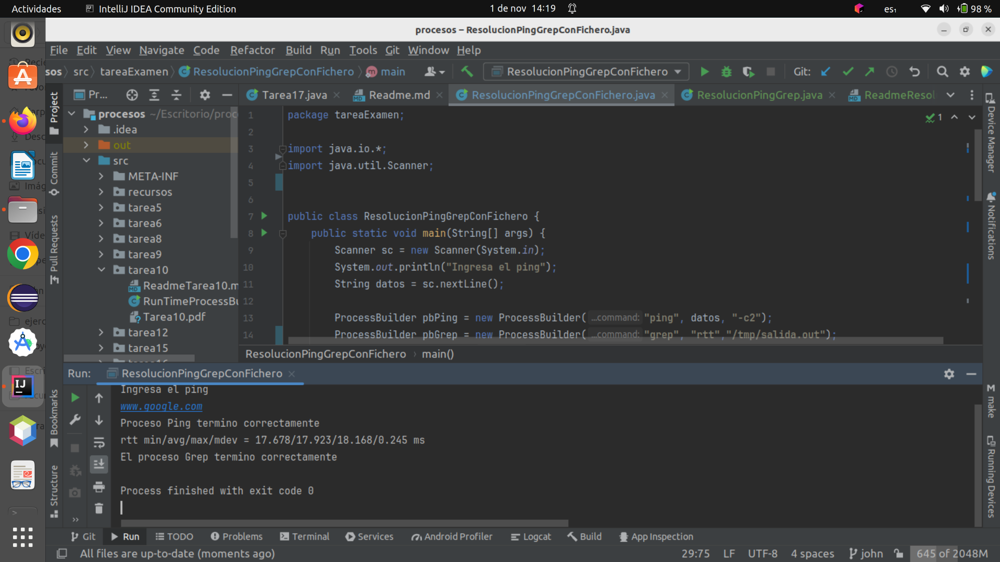

# Tarea Examen
---

Usando las clases ProcessBuilder y Process ejecuta un proceso que realice un ping a un host
determinado y usando bien grep en GNU/Linux o el comando find en Windows te muestre la
estadística final. Ejemplo de ejecución en GNU/Linux:
* ping www.google.es -c2 | grep rtt 
* rtt min/avg/max/mdev = 14.855/15.097/15.339/0.242 ms
___

> “El ejercicio se realizará no como un único proceso, sino como dos procesos donde la
salida del comando ping es la entrada del comando grep o find”.

Se pide:
1. Implementar el ejercicio llamado ResolucionPingGrepConFichero.java , utilizando un
   fichero como método de intercambio entre ambos procesos. Dicho fichero deberá estar
   ubicado en el directorio /tmp. y su nombre será salida.out. Indicaciones:
2.

   * Deberéis capturar y tratar las excepciones dentro del método main. 
   * Crear ambos ProcessBuilder llamados pbPing y pbGrep con la configuración de
      los comandos ping y grep. 
   * Crearemos dentro del bloque try, el fichero que el proceso con nombre procPing
      creará, redireccionando su salida a dicho fichero. Recordar realizar algo como
      pbPing.redirectOutput(fich)
   * Lanzaremos primeramente el proceso procPing y muy importante, deberemos
      esperar con un waitFor. El motivo es muy sencillo. El proceso ping, puede
      bloquearse esperando la finalización de la operación de E/S en el fichero y en su
      lugar se ejecutará el padre, por tanto no dará tiempo al grep a leer del fichero. 
   * Lanzaremos inmediatamente después del waitFor, el proceso grep llamado
      procGrep. 
   * Crearemos un flujo de entrada hacia el proceso padre, conectándolo con la salida
      del proceso hijo (procGrep). Debemos invocar al método getInputStream()
      utilizando un objeto de tipo Scanner. 
   * Se imprimirá por pantalla todo lo que lea el padre de su flujo de entrada, línea a
      línea.
___

Creamos la clase `ResolucionPingGrepConFichero`:
___

```java
public class ResolucionPingGrepConFichero {
    public static void main(String[] args) {
        Scanner sc = new Scanner(System.in);
        System.out.println("Ingresa el ping");
        String datos = sc.nextLine();

        ProcessBuilder pbPing = new ProcessBuilder("ping", datos, "-c2");
        ProcessBuilder pbGrep = new ProcessBuilder("grep", "rtt","/tmp/salida.out");
        File fichero = new File("/tmp/salida.out");
        pbPing.redirectOutput(fichero);
        try {
            Process pping = pbPing.start();
            int codigo = pping.waitFor();
            String resultado = (codigo == 0) ? "Proceso Ping termino correctamente" : "Error en el proceso Ping";
            System.out.println(resultado);
            Process pGrep = pbGrep.start();
            Scanner in = new Scanner(pGrep.getInputStream());
            while (in.hasNextLine()) {
                System.out.println(in.nextLine());
            }
            in.close();
            codigo = pGrep.waitFor();
            System.out.println((codigo == 0) ? "El proceso Grep termino correctamente" : "Error en el proceso Grep");
        } catch (IOException | InterruptedException e) {
            System.out.println(e.getMessage());
        }

    }
}

```
___

Ejecutamos el programa `ResolucionPingGrepConFichero`
___



___


# Documentación del Código: ResolucionPingGrepConFichero

Este documento proporciona una descripción detallada del funcionamiento del código fuente de la clase 
**ResolucionPingGrepConFichero**. Este programa en Java ejecuta un proceso de ping a un host determinado y utiliza el 
comando grep en un fichero para mostrar la estadística final. Aquí se explicará cada sección del código.

## Descripción General

La clase **ResolucionPingGrepConFichero** es responsable de realizar un ping a un host especificado y luego buscar y 
mostrar las estadísticas de respuesta del ping utilizando el comando `grep`. El resultado del comando `ping` se redirige
a un archivo llamado "salida.out" ubicado en el directorio `/tmp`.

## Funcionamiento Detallado

1. El programa comienza solicitando al usuario que ingrese la dirección o el host al que desea realizar un ping.

2. Luego, se crea un objeto `ProcessBuilder` llamado `pbPing` para ejecutar el comando `ping` con la dirección ingresada
   y la opción `-c2`, que realiza dos intentos de ping.

3. Se crea otro objeto `ProcessBuilder` llamado `pbGrep` para ejecutar el comando `grep`. El comando `grep` buscará 
   líneas que contengan "rtt" en el archivo `/tmp/salida.out`.

4. Se crea un objeto `File` llamado `fichero` que representa el archivo de salida `/tmp/salida.out`.

5. Se redirige la salida del proceso `pbPing` al archivo `fichero` utilizando el método `pbPing.redirectOutput(fichero)`.

6. Se inicia el proceso `pbPing` utilizando `pbPing.start()` y se espera a que finalice mediante `ping.waitFor()`. El 
   resultado del comando ping se almacena en la variable `codigo`.

7. Se verifica si el `codigo` es igual a cero, lo que indica que el proceso ping finalizó correctamente. Se muestra un 
   mensaje apropiado en consecuencia.

8. Luego, se inicia el proceso `pbGrep` para buscar estadísticas de respuesta de ping en el archivo `/tmp/salida.out`.

9. Se crea un objeto `Scanner` llamado `in` para leer la salida del proceso `pbGrep`.

10. Se recorre y se muestra cada línea de la salida del proceso `pbGrep` hasta que no haya más líneas disponibles.

11. Se cierra el flujo de entrada `in`.

12. Se vuelve a verificar el código de salida de `pbGrep` y se muestra un mensaje apropiado en función del resultado.

13. Se manejan las excepciones de tipo `IOException` e `InterruptedException` y se muestra un mensaje de error en caso 
    de producirse una excepción.

## Conclusión

La clase **ResolucionPingGrepConFichero** permite al usuario realizar un ping a un host, redirigir la salida al archivo 
`/tmp/salida.out` y luego buscar y mostrar las estadísticas de respuesta del ping utilizando el comando `grep`. El 
código es robusto y maneja posibles excepciones que puedan ocurrir durante la ejecución.
___

[Repositorio](https://github.com/johnlopez0505/procesos.git)

___
